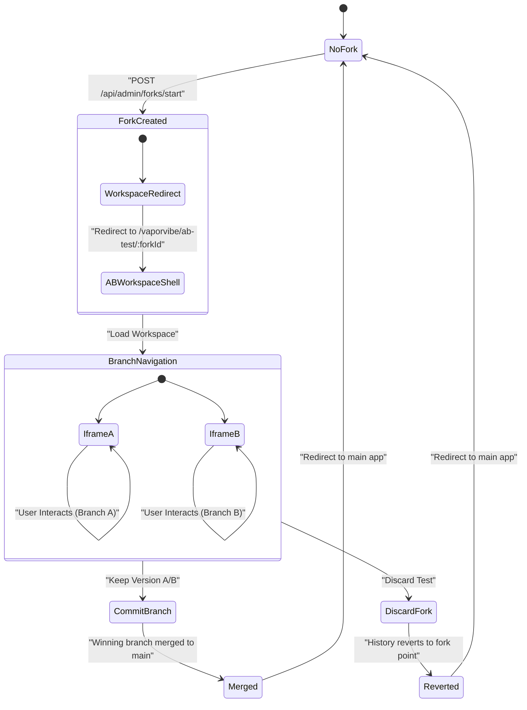
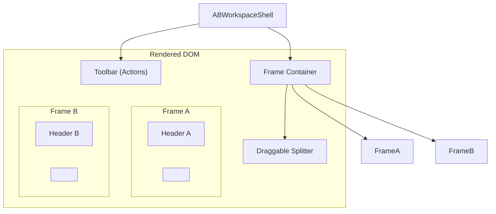

# Content from docs/architecture/ab-testing.md

# Architecture: A/B Testing & Forks

> **Scope**: Explains the fork system that enables A/B testing, including data models, UI integration, and resolution flows.

## Purpose
The A/B testing system allows users to create two isolated branches ("A" and "B") from a single history point. Each branch receives different instructions, allowing the user to compare how the LLM executes different prompts side-by-side.

## Core Concepts

### 1. The Fork Data Model
A "Fork" is a container for two parallel timelines.
-   **Fork ID**: Unique UUID.
-   **Origin Entry**: The history entry *before* the divergence.
-   **Branches**: A map of two `BranchState` objects.

### 2. Branch Isolation
Each branch acts like a mini-session. It has its own:
-   **History**: An array of `HistoryEntry` objects that grows independently.
-   **PrevHtml**: The context for the next prompt.
-   **REST State**: Virtual mutations (e.g., "Add Todo") are isolated. Branch A can have 5 todos while Branch B has 3.
-   **Component Cache**: Cached HTML fragments are tracked separately to prevent ID collisions.

### 3. UI Integration (`ABWorkspaceShell`)
The frontend renders two iframes side-by-side.
-   **URL Context**: Each iframe loads the app with `?__vaporvibe_branch=<branchId>`.
-   **Interception**: The `vaporvibe-interceptor.js` script ensures that any link clicked inside the iframe preserves the `__vaporvibe_branch` parameter, keeping the user "trapped" in the correct timeline.

## Lifecycle & Resolution

### Resolution Flow
When the user makes a decision (e.g., "Keep Version A"):
1.  **UI Action**: User clicks "Keep Version A" in the toolbar.
2.  **API Call**: The shell calls `keepAbForkVersion(forkId, branchId)`.
3.  **Server Action**: The server merges Branch A's history and resolves the fork.
4.  **Redirect**: The shell redirects the top-level window back to the application URL (without the branch param), effectively exiting the A/B test mode.

## Deep Dive: Frontend Integration

### The Workspace Shell (`ABWorkspaceShell.tsx`)
The A/B testing UI is a specialized "shell" that hosts two isolated instances of the application.

-   **Dual Iframes**: Renders two `<iframe>` elements, one for each branch.
-   **URL Construction**: Appends `?__vaporvibe_branch=<branchId>` to the source URL.
-   **Splitter Logic**: Custom resize handler allows dragging the divider (snapping to 50/50).

### Navigation Interception (Shadow History)
To keep the user "trapped" in the correct branch as they navigate, we inject `vaporvibe-interceptor.js`. This script implements a **Shadow History** mechanism.

1.  **Link Clicking**: Appends `&__vaporvibe_branch=ID` to destination URLs.
2.  **Form Submission**: Injects `<input type="hidden" name="__vaporvibe_branch" value="ID">`.
3.  **Fetch API**: Monkey-patches `window.fetch` to add the branch parameter to AJAX requests.
4.  **History API Override**:
    -   It wraps `history.pushState` and `history.replaceState`.
    -   **Why?** If the LLM generates a client-side router (e.g., React Router) that updates the URL to `/about`, the interceptor silently re-appends the branch ID. This ensures that even "invisible" navigations don't break the branch isolation.

## Key Files
-   **Backend**: `src/server/session-store.ts` (Fork logic), `src/server/server.ts` (Request routing).
-   **Frontend**: `src/components/ABWorkspaceShell.tsx` (UI), `src/interceptor-branch-utils.ts` (Context propagation).

