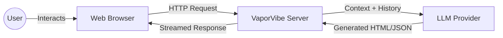
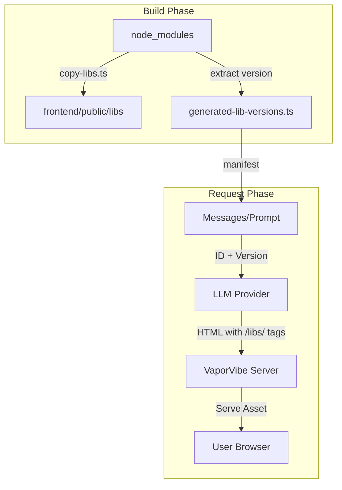

# Content from docs/ARCHITECTURE.md

# VaporVibe System Architecture

> **System Overview**: VaporVibe is a "Generative Application Server". It uses Large Language Models (LLMs) to generate, serve, and maintain stateful web applications on the fly.

## 🔭 High-Level Context

Unlike a traditional web server that serves static files or database content, VaporVibe serves **hallucinated** content that becomes real through user interaction.

## 🧠 Core Philosophies

### 1. The Illusion of Persistence
The applications generated by VaporVibe have no database. When a user "saves" a todo item, we don't write to SQL. Instead, we record the **intent** (mutation) and feed it back to the LLM in the next prompt. The LLM "remembers" the item and renders it in the HTML.
*   👉 [Deep Dive: Virtual REST API](./architecture/virtual-rest-api.md)

### 2. Code is Data
HTML, CSS, and Javascript are treated as ephemeral data streams, not static assets. We cache them to save tokens, but they are fundamentally fluid. A "component" is just a string of text that the LLM decided to reuse.
*   👉 [Deep Dive: Token Optimization](./architecture/token-optimization.md)

### 3. Sandboxed Execution
Since we are serving AI-generated code, security is paramount. All generated applications run inside a sandboxed `<iframe>` within the `ABWorkspaceShell`. This isolates the "guest" code from the "host" admin dashboard.
*   👉 [Deep Dive: A/B Testing & Forks](./architecture/ab-testing.md)

## 🔌 Protocol Constants
The system relies on specific "Magic Strings" to glue the Frontend, Backend, and LLM together. These are defined in `src/constants.ts` and form the implicit protocol of VaporVibe.

| Constant                      | Value                         | Purpose                                                                               |
| :---------------------------- | :---------------------------- | :------------------------------------------------------------------------------------ |
| **`INSTRUCTIONS_FIELD`**      | `LLM_WEB_SERVER_INSTRUCTIONS` | Form field name injected by the frontend to send user feedback/prompts to the server. |
| **`BRANCH_FIELD`**            | `__vaporvibe_branch`          | URL query parameter used to route requests to the correct A/B testing fork.           |
| **`LLM_RESULT_ROUTE_PREFIX`** | `/__vaporvibe/result`         | Endpoint polled by the Loading Shell to retrieve the final generated HTML.            |

## 🏗️ System Components

### Server Layer (`src/server/`)
A Node.js/Express server that acts as the orchestrator.
-   **Session Store**: The "RAM" of the system. Holds conversation history and state.
-   **Controllers**: Handle Admin APIs, Virtual REST calls, and HTML serving.
-   **Streaming**: Manages the complex flow of chunks from LLM -> Parser -> Browser.

### LLM Layer (`src/llm/`)
An adapter layer that normalizes different providers into a standard interface.
-   **Client Interface**: `generateHtml()` and `stream()`.
-   **Providers**: OpenAI, Anthropic, Gemini, Grok, Groq.
-   **Reasoning**: Extracts "hidden" thought chains from models that support them.
*   👉 [Deep Dive: LLM Pipeline](./architecture/llm-pipeline.md)

### Image Generation Layer (`src/image-gen/`)
A modular system for generating images on-demand.
-   **Provider Clients**: OpenAI (DALL-E, GPT Image) and Google (Imagen, Nano Banana).
-   **Caching**: In-memory cache keyed by `modelId:ratio:prompt` to prevent redundant API calls.
-   **REST Endpoint**: Exposed via `/rest_api/image/generate` for LLM-generated apps.

### Frontend Layer (`frontend/src/`)
A React-based "Shell" that wraps the generated content.
-   **Dashboard**: Admin controls for model selection and history management.
-   **Workspace**: The split-screen view for A/B testing.
-   **Interceptor**: Client-side JS that intercepts clicks to keep users in the correct session branch.

### Frontend Runtime & Standard Library
-   **Static library route**: `/libs/*` serves assets from `frontend/public/libs` with correct MIME types for JS, CSS, images, and fonts. Caching is immutable for fast reuse.
-   **Toggle**: Controlled by `enableStandardLibrary` (env `ENABLE_STANDARD_LIBRARY`, default `true`). When disabled, `/libs/*` returns 404.
-   **Pipeline Flow**:

-   See [`docs/STANDARD_LIBRARY.md`](./STANDARD_LIBRARY.md) for the full catalog and maintenance steps.

## 📚 Documentation Index

### Architecture Deep Dives
| Topic                                                          | Description                                               |
| :------------------------------------------------------------- | :-------------------------------------------------------- |
| [**A/B Testing**](./architecture/ab-testing.md)                | Branching logic, fork data models, and UI isolation.      |
| [**Virtual REST API**](./architecture/virtual-rest-api.md)     | Fake backend, mutation recording, and state persistence.  |
| [**Admin Control Plane**](./architecture/admin-api.md)         | Configuration, API key management, and security.          |
| [**Session Lifecycle**](./architecture/session-lifecycle.md)   | In-memory storage, eviction policies, and history format. |
| [**Token Optimization**](./architecture/token-optimization.md) | Component caching and placeholder resolution.             |
| [**LLM Pipeline**](./architecture/llm-pipeline.md)             | Data flow, streaming, and reasoning extraction.           |
| [**Transition UX**](./architecture/transition-ux.md)           | Loading shell, waiting effects, and overlay mechanics.    |
| [**Download Tour**](./architecture/download-tour.md)           | Clickthrough prototypes with Driver.js walkthroughs.      |

### Module Documentation
Detailed API references for specific subsystems:
*   [**Server Core**](../docs/modules/server/server.md)
*   [**Session Store**](../docs/modules/server/session-store.md)
*   [**Admin Controller**](../docs/modules/server/admin-controller.md)
*   [**REST Controller**](../docs/modules/server/rest-api-controller.md)
*   [**LLM Client**](../docs/modules/llm/client.md)
*   [**Image Generation**](../docs/modules/image-gen.md)
*   [**Credential Store**](../docs/modules/utils/credential-store.md)

### 🤖 LLM Providers
Implementation details for each supported model family:
*   [**OpenAI**](../docs/modules/llm/providers/openai.md) (GPT-4o, o1)
*   [**Anthropic**](../docs/modules/llm/providers/anthropic.md) (Claude 3.5, Thinking)
*   [**Google Gemini**](../docs/modules/llm/providers/gemini.md) (1.5 Pro, 2.0 Flash)
*   [**xAI Grok**](../docs/modules/llm/providers/grok.md) (Grok 2/3)
*   [**Groq**](../docs/modules/llm/providers/groq.md) (Llama 3, Mixtral)

### Codebase Map
*   [**Visual Dependency Graph**](./CODEBASE_MAP.md)

