# Content from docs/CODEBASE_MAP.md

# Codebase Import/Export Map

> **Auto-generated documentation for LLM context**  
> Last updated: 2025-12-23T21:23:11.868Z  
> Generated by: `npm run gen:codebase-map`

This document provides detailed import/export relationships, showing which specific symbols (functions, classes, types, variables) are imported by each module.

---

## Backend (src/)

**Total Modules**: 60  
**External Packages**: 23

---

### Architecture Overview

```mermaid
graph TD
  cli["cli/<br/>1 modules"]
  config["config/<br/>3 modules"]
  constants["constants/<br/>1 modules"]
  root["root/<br/>4 modules"]
  dev["dev/<br/>1 modules"]
  image_gen["image-gen/<br/>8 modules"]
  llm["llm/<br/>13 modules"]:::llmNode
  server["server/<br/>7 modules"]:::serverNode
  types["types/<br/>2 modules"]
  utils["utils/<br/>14 modules"]:::utilNode
  views["views/<br/>6 modules"]:::viewNode
  cli --> types
  config --> generated_lib_versions
  config --> constants
  config --> utils
  config --> logger
  config --> types
  config --> cli
  constants --> llm
  constants --> types
  constants_ts --> llm
  constants_ts --> types
  dev --> logger
  dev --> index
  dev --> server
  image_gen --> logger
  image_gen --> paths
  image_gen --> types
  image_gen --> cache
  image_gen --> providers
  image_gen --> __
  image_gen --> retry
  index_ts --> cli
  index_ts --> config
  index_ts --> llm
  index_ts --> server
  index_ts --> logger
  index_ts --> types
  llm --> logger
  llm --> types
  llm --> client
  llm --> openai_client
  llm --> gemini_client
  llm --> anthropic_client
  llm --> grok_client
  llm --> groq_client
  llm --> openrouter_client
  llm --> capabilities
  llm --> config
  llm --> model_catalog
  server --> logger
  server --> constants
  server --> utils
  server --> llm
  server --> config
  server --> image_gen
  server --> component_cache
  server --> session_store
  server --> brief_attachments
  server --> types
  server --> history_utils
  server --> views
  server --> admin_controller
  server --> rest_api_controller
  types --> constants
  types --> llm
  utils --> logger
  utils --> types
  utils --> constants
  utils --> history_export
  utils --> sensitive
  utils --> image_gen
  utils --> image_reencoder
  utils --> frontend_assets
  utils --> views
  views --> loading_shell
  views --> constants
  views --> utils

  classDef serverNode fill:#e3f2fd,stroke:#1976d2,stroke-width:2px
  classDef llmNode fill:#f3e5f5,stroke:#7b1fa2,stroke-width:2px
  classDef viewNode fill:#e8f5e9,stroke:#388e3c,stroke-width:2px
  classDef utilNode fill:#fff3e0,stroke:#f57c00,stroke-width:2px
```

---

### Key Module Dependencies

_Top 10 modules by import count_

```mermaid
graph LR
  server_admin_controller_ts["admin-controller.ts"]
  ___logger_js["logger"] --> server_admin_controller_ts
  ___constants_js["constants"] --> server_admin_controller_ts
  ___constants_providers_js["providers"] --> server_admin_controller_ts
  ___utils_history_archive_js["history-archive"] --> server_admin_controller_ts
  ___llm_factory_js["factory"] --> server_admin_controller_ts
  server_server_ts["server.ts"]
  ___constants_js["constants"] --> server_server_ts
  ___constants_providers_js["providers"] --> server_server_ts
  ___llm_messages_js["messages"] --> server_server_ts
  ___llm_capabilities_js["capabilities"] --> server_server_ts
  ___utils_cookies_js["cookies"] --> server_server_ts
  server_rest_api_controller_ts["rest-api-controller.ts"]
  ___llm_capabilities_js["capabilities"] --> server_rest_api_controller_ts
  ___llm_messages_js["messages"] --> server_rest_api_controller_ts
  ___utils_cookies_js["cookies"] --> server_rest_api_controller_ts
  ___utils_body_js["body"] --> server_rest_api_controller_ts
  __history_utils_js["history-utils"] --> server_rest_api_controller_ts
  index_ts["index.ts"]
  __cli_args_js["args"] --> index_ts
  __config_runtime_config_js["runtime-config"] --> index_ts
  __llm_factory_js["factory"] --> index_ts
  __server_session_store_js["session-store"] --> index_ts
  __server_server_js["server"] --> index_ts
  dev_backend_dev_server_ts["backend-dev-server.ts"]
  ___logger_js["logger"] --> dev_backend_dev_server_ts
  ___index_js["index"] --> dev_backend_dev_server_ts
  ___server_server_js["server"] --> dev_backend_dev_server_ts
  ___server_session_store_js["session-store"] --> dev_backend_dev_server_ts
  llm_factory_ts["factory.ts"]
  __openai_client_js["openai-client"] --> llm_factory_ts
  __gemini_client_js["gemini-client"] --> llm_factory_ts
  __anthropic_client_js["anthropic-client"] --> llm_factory_ts
  __grok_client_js["grok-client"] --> llm_factory_ts
  __groq_client_js["groq-client"] --> llm_factory_ts
  image_gen_cache_ts["cache.ts"]
  ___logger_js["logger"] --> image_gen_cache_ts
  __paths_js["paths"] --> image_gen_cache_ts
  __types_js["types"] --> image_gen_cache_ts
  ___types_js["types"] --> image_gen_cache_ts
  llm_verification_ts["verification.ts"]
  __openai_client_js["openai-client"] --> llm_verification_ts
  __gemini_client_js["gemini-client"] --> llm_verification_ts
  __anthropic_client_js["anthropic-client"] --> llm_verification_ts
  __grok_client_js["grok-client"] --> llm_verification_ts
  __groq_client_js["groq-client"] --> llm_verification_ts
  config_runtime_config_ts["runtime-config.ts"]
  ___constants_js["constants"] --> config_runtime_config_ts
  ___utils_credential_store_js["credential-store"] --> config_runtime_config_ts
  ___utils_config_store_js["config-store"] --> config_runtime_config_ts
  ___logger_js["logger"] --> config_runtime_config_ts
  ___types_js["types"] --> config_runtime_config_ts
  server_session_store_ts["session-store.ts"]
  ___utils_cookies_js["cookies"] --> server_session_store_ts
  ___utils_html_js["html"] --> server_session_store_ts
  ___image_gen_paths_js["paths"] --> server_session_store_ts
  ___types_js["types"] --> server_session_store_ts
```

---

### External Dependencies

#### `node:url`

Used by 7 module(s)

#### `node:path`

Used by 6 module(s)

#### `node:crypto`

Used by 6 module(s)

#### `node:fs`

Used by 6 module(s)

#### `openai`

Used by 4 module(s)

#### `pino`

Used by 4 module(s)

#### `node:http`

Used by 4 module(s)

#### `node:process`

Used by 3 module(s)

#### `@google/genai`

Used by 2 module(s)

#### `@openrouter/sdk`

Used by 2 module(s)

#### `jszip`

Used by 2 module(s)

#### `node:buffer`

Used by 2 module(s)

#### `node:module`

Used by 1 module(s)

#### `chokidar`

Used by 1 module(s)

#### `node:os`

Used by 1 module(s)

#### `open`

Used by 1 module(s)

#### `@anthropic-ai/sdk`

Used by 1 module(s)

#### `node-html-parser`

Used by 1 module(s)

#### `node:child_process`

Used by 1 module(s)

#### `node:stream`

Used by 1 module(s)

#### `node:querystring`

Used by 1 module(s)

#### `conf`

Used by 1 module(s)

#### `sharp`

Used by 1 module(s)

---

### Module Import Details

#### `cli/args.ts`

**Internal Imports:**

- From `../types.js`: `ModelProvider`

#### `config/generated-lib-versions.ts`

_No imports_

#### `config/library-manifest.ts`

**Internal Imports:**

- From `./generated-lib-versions.js`: `LIB_VERSIONS`
- From `/libs/three.module.js`: `* as THREE`

#### `config/runtime-config.ts`

**Internal Imports:**

- From `../constants.js`: `DEFAULT_GEMINI_MODEL`, `DEFAULT_GROK_MODEL`, `DEFAULT_GROQ_MODEL`, `DEFAULT_MAX_OUTPUT_TOKENS`, `DEFAULT_OPENAI_MODEL`, `DEFAULT_OPENROUTER_MODEL`, `DEFAULT_PORT`, `DEFAULT_ANTHROPIC_MODEL`, `DEFAULT_ANTHROPIC_MAX_OUTPUT_TOKENS`, `DEFAULT_HISTORY_LIMIT`, `DEFAULT_HISTORY_MAX_BYTES`, `DEFAULT_REASONING_TOKENS`, `LOOPBACK_HOST`, `SETUP_ROUTE`
- From `../utils/credential-store.js`: `getCredentialStore`
- From `../utils/config-store.js`: `getConfigStore`
- From `../logger.js`: `logger`
- From `../types.js`: `AppConfig`, `ModelProvider`, `ImageModelId`, `ImageGenConfig`, `ProviderSettings`, `ReasoningMode`, `RuntimeConfig`
- From `../cli/args.js`: `CliOptions`

#### `constants.ts`

**Internal Imports:**

- From `./llm/model-catalog.js`: `PROVIDER_METADATA`
- From `./types.js`: `ModelProvider`

#### `constants/providers.ts`

**Internal Imports:**

- From `../llm/model-catalog.js`: `PROVIDER_METADATA`, `type ProviderMetadata`, `type ModelMetadata`, `getModelOptions`, `getModelMetadata`, `getFeaturedModels`
- From `../constants.js`: `DEFAULT_REASONING_TOKENS`
- From `../types.js`: `ModelProvider`, `ReasoningMode`, `ImageGenProvider`

#### `dev/backend-dev-server.ts`

**Internal Imports:**

- From `../logger.js`: `logger`
- From `../index.js`: `startVaporVibe`, `type StartOptions`, `type StartResult`
- From `../server/server.js`: `snapshotServerState`, `type ServerStateSnapshot`, `DevFrontendServer`
- From `../server/session-store.js`: `SessionStoreSnapshot`

**External Imports:**

- From `node:url`: `fileURLToPath`
- From `node:module`: `createRequire`
- From `node:path`: `default as path`
- From `node:process`: `default as process`
- From `chokidar`: `default as chokidar`

#### `image-gen/cache.ts`

**Internal Imports:**

- From `../logger.js`: `logger`
- From `./paths.js`: `GENERATED_IMAGES_DIR`, `getGeneratedImagePath`
- From `./types.js`: `ImageGenClient`, `ImageGenOptions`, `ImageGenResult`
- From `../types.js`: `ImageAspectRatio`, `ImageGenProvider`, `ImageModelId`

**External Imports:**

- From `node:crypto`: `createHash`
- From `node:fs`: `existsSync`
- From `node:fs/promises`: `mkdir`, `readFile`, `writeFile`

#### `image-gen/factory.ts`

**Internal Imports:**

- From `./cache.js`: `CachedImageGenClient`
- From `./providers/google.js`: `GoogleImageGenClient`
- From `./providers/openai.js`: `OpenAiImageGenClient`
- From `./providers/openrouter.js`: `OpenRouterImageGenClient`
- From `./types.js`: `ImageGenClient`

#### `image-gen/paths.ts`

**External Imports:**

- From `node:path`: `dirname`, `resolve`
- From `node:url`: `fileURLToPath`
- From `node:os`: `tmpdir`

#### `image-gen/providers/google.ts`

**Internal Imports:**

- From `../../logger.js`: `logger`
- From `../retry.js`: `withRetry`
- From `../types.js`: `ImageGenClient`, `ImageGenOptions`, `ImageGenResult`

**External Imports:**

- From `@google/genai`: `GoogleGenAI`

#### `image-gen/providers/openai.ts`

**Internal Imports:**

- From `../../logger.js`: `logger`
- From `../retry.js`: `withRetry`
- From `../types.js`: `ImageGenClient`, `ImageGenOptions`, `ImageGenResult`

**External Imports:**

- From `openai`: `default as OpenAI`

#### `image-gen/providers/openrouter.ts`

**Internal Imports:**

- From `../../logger.js`: `logger`
- From `../retry.js`: `withRetry`
- From `../types.js`: `ImageGenClient`, `ImageGenOptions`, `ImageGenResult`

#### `image-gen/retry.ts`

**Internal Imports:**

- From `../logger.js`: `logger`

#### `image-gen/types.ts`

**Internal Imports:**

- From `../types.js`: `ImageAspectRatio`, `ImageModelId`, `ImageGenProvider`

#### `index.ts`

**Internal Imports:**

- From `./cli/args.js`: `parseCliArgs`
- From `./config/runtime-config.js`: `resolveAppConfig`
- From `./llm/factory.js`: `createLlmClient`
- From `./server/session-store.js`: `SessionStore`, `type SessionStoreSnapshot`
- From `./server/server.js`: `createServer`, `createServerState`, `ensureFrontendAssetsOnce`, `type MutableServerState`, `type ServerStateConfig`, `type ServerStateSnapshot`, `DevFrontendServer`
- From `./logger.js`: `logger`
- From `./types.js`: `AppConfig`

**External Imports:**

- From `node:url`: `fileURLToPath`
- From `node:process`: `default as process`
- From `open`: `default as open`

#### `llm/anthropic-client.ts`

**Internal Imports:**

- From `../logger.js`: `logger`
- From `../types.js`: `BriefAttachment`, `CacheControlSettings`, `ChatMessage`, `LlmReasoningTrace`, `LlmUsageMetrics`, `ProviderSettings`, `VerificationResult`