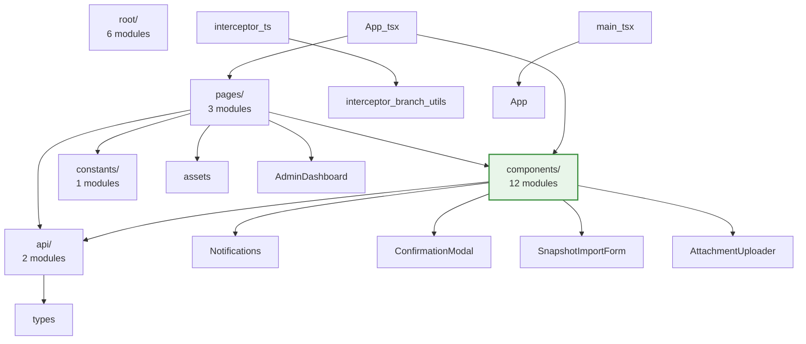

- From `../types.js`: `ChatMessage`, `LlmReasoningTrace`, `LlmUsageMetrics`, `ProviderSettings`, `VerificationResult`, `ReasoningMode`
- From `./client.js`: `LlmClient`, `LlmResult`, `LlmGenerateOptions`, `LlmStreamObserver`

**External Imports:**

- From `openai`: `default as OpenAI`

#### `llm/messages.ts`

**Internal Imports:**

- From `../types.js`: `BriefAttachment`, `ChatMessage`, `HistoryEntry`

#### `llm/model-catalog.ts`

**Internal Imports:**

- From `../types.js`: `ModelProvider`, `ReasoningMode`

#### `llm/openai-client.ts`

**Internal Imports:**

- From `../logger.js`: `logger`
- From `../types.js`: `ChatMessage`, `LlmReasoningTrace`, `LlmUsageMetrics`, `ProviderSettings`, `VerificationResult`
- From `./client.js`: `LlmClient`, `LlmResult`, `LlmGenerateOptions`

**External Imports:**

- From `openai`: `default as OpenAI`

#### `llm/verification.ts`

**Internal Imports:**

- From `./openai-client.js`: `verifyOpenAiApiKey`
- From `./gemini-client.js`: `verifyGeminiApiKey`
- From `./anthropic-client.js`: `verifyAnthropicApiKey`
- From `./grok-client.js`: `verifyGrokApiKey`
- From `./groq-client.js`: `verifyGroqApiKey`
- From `../types.js`: `ModelProvider`, `VerificationResult`

#### `logger.ts`

**External Imports:**

- From `pino`: `default as pino`

#### `server/admin-controller.ts`

**Internal Imports:**

- From `../constants.js`: `ADMIN_ROUTE_PREFIX`, `HISTORY_LIMIT_MIN`, `HISTORY_LIMIT_MAX`, `HISTORY_MAX_BYTES_MIN`, `HISTORY_MAX_BYTES_MAX`
- From `../constants/providers.js`: `PROVIDER_CHOICES`, `PROVIDER_LABELS`, `PROVIDER_PLACEHOLDERS`, `PROVIDER_REASONING_CAPABILITIES`, `PROVIDER_MEDIA_RESOLUTION_CAPABILITIES`, `PROVIDER_REASONING_MODES`, `PROVIDER_TOKEN_GUIDANCE`, `DEFAULT_MODEL_BY_PROVIDER`, `DEFAULT_MAX_TOKENS_BY_PROVIDER`, `REASONING_MODE_CHOICES`, `getModelOptions`, `getModelMetadata`, `getFeaturedModels`, `PROVIDER_MODEL_METADATA`, `CUSTOM_MODEL_DESCRIPTION`
- From `../llm/factory.js`: `createLlmClient`
- From `../llm/verification.js`: `verifyProviderApiKey`
- From `../utils/body.js`: `readBody`, `ParsedFile`
- From `../utils/cookies.js`: `parseCookies`
- From `../utils/sensitive.js`: `maskSensitive`
- From `../utils/history-export.js`: `createHistorySnapshot`, `createPromptMarkdown`
- From `./session-store.js`: `SessionStore`
- From `../utils/credential-store.js`: `getCredentialStore`
- From `../utils/config-store.js`: `getConfigStore`
- From `./brief-attachments.js`: `processBriefAttachmentFiles`
- From `../types.js`: `BriefAttachment`, `HistoryEntry`, `ImageGenProvider`, `ImageModelId`, `ProviderSettings`, `ReasoningMode`, `ModelProvider`, `RestMutationRecord`, `RestQueryRecord`
- From `./server.js`: `MutableServerState`, `RequestContext`
- From `../types/admin-api.js`: `AdminActiveForkSummary`, `AdminBriefAttachment`, `AdminHistoryItem`, `AdminHistoryResponse`, `AdminProviderInfo`, `AdminRestItem`, `AdminRestMutationItem`, `AdminRestQueryItem`, `AdminRuntimeInfo`, `AdminStateResponse`, `AdminUpdateResponse`

**External Imports:**

- From `node:http`: `ServerResponse`
- From `pino`: `Logger`

#### `server/brief-attachments.ts`

**Internal Imports:**

- From `../types.js`: `BriefAttachment`
- From `../utils/body.js`: `ParsedFile`

**External Imports:**

- From `node:crypto`: `randomUUID`

#### `server/component-cache.ts`

**External Imports:**

- From `node-html-parser`: `parse`, `HTMLElement`

#### `server/history-utils.ts`

**Internal Imports:**

- From `../types.js`: `HistoryEntry`

**External Imports:**

- From `node:buffer`: `Buffer`

#### `server/rest-api-controller.ts`

**Internal Imports:**

- From `../llm/capabilities.js`: `supportsImageInput`
- From `../llm/messages.js`: `buildMessages`
- From `../utils/cookies.js`: `parseCookies`
- From `../utils/body.js`: `readBody`
- From `./history-utils.js`: `selectHistoryForPrompt`
- From `./session-store.js`: `SessionStore`
- From `../image-gen/factory.js`: `createImageGenClient`
- From `../image-gen/paths.js`: `GENERATED_IMAGES_DIR`, `getGeneratedImagePath`
- From `../utils/credential-store.js`: `getCredentialStore`
- From `../llm/client.js`: `LlmClient`
- From `../types.js`: `BriefAttachment`, `HistoryEntry`, `ImageGenProvider`, `RestMutationRecord`, `RestQueryRecord`, `RuntimeConfig`, `ProviderSettings`
- From `./server.js`: `RequestContext`
- From `../image-gen/types.js`: `ImageAspectRatio`, `ImageGenResult`

**External Imports:**

- From `node:crypto`: `createHash`, `randomUUID`
- From `node:fs`: `existsSync`
- From `node:fs/promises`: `mkdir`, `writeFile`
- From `pino`: `Logger`

#### `server/server.ts`

**Internal Imports:**

- From `../constants.js`: `ADMIN_ROUTE_PREFIX`, `AUTO_IGNORED_PATHS`, `BRIEF_FORM_ROUTE`, `INSTRUCTIONS_FIELD`, `SETUP_ROUTE`, `OVERLAY_DEBUG_ROUTE`, `SETUP_VERIFY_ROUTE`, `DEFAULT_OPENAI_MODEL`, `DEFAULT_GEMINI_MODEL`, `DEFAULT_ANTHROPIC_MODEL`, `DEFAULT_GROK_MODEL`, `DEFAULT_GROQ_MODEL`, `DEFAULT_MAX_OUTPUT_TOKENS`, `DEFAULT_ANTHROPIC_MAX_OUTPUT_TOKENS`, `DEFAULT_REASONING_TOKENS`, `LLM_RESULT_ROUTE_PREFIX`, `LLM_REASONING_STREAM_ROUTE_PREFIX`
- From `../constants/providers.js`: `DEFAULT_MAX_TOKENS_BY_PROVIDER`, `PROVIDER_REASONING_CAPABILITIES`
- From `../llm/messages.js`: `buildMessages`
- From `../llm/capabilities.js`: `supportsImageInput`
- From `../utils/cookies.js`: `parseCookies`
- From `../utils/body.js`: `readBody`
- From `../utils/html.js`: `ensureHtmlDocument`, `escapeHtml`
- From `./session-store.js`: `SessionStore`
- From `./component-cache.js`: `applyReusablePlaceholders`, `prepareReusableCaches`
- From `../utils/navigation-interceptor.js`: `getNavigationInterceptorScript`
- From `../utils/instructions-panel.js`: `getInstructionsPanelScript`
- From `../views/loading-shell.js`: `renderLoadingShell`, `renderResultHydrationScript`, `renderLoaderErrorScript`
- From `../views/overlay-debug.js`: `renderOverlayDebugPage`
- From `../logger.js`: `logger`
- From `./admin-controller.js`: `AdminController`
- From `../llm/factory.js`: `createLlmClient`
- From `../llm/gemini-client.js`: `shouldEnableGeminiThoughts`
- From `../utils/credential-store.js`: `getCredentialStore`
- From `./rest-api-controller.js`: `RestApiController`
- From `./history-utils.js`: `selectHistoryForPrompt`
- From `../image-gen/paths.js`: `GENERATED_IMAGES_DIR`, `GENERATED_IMAGES_ROUTE`, `RUNTIME_DIST_DIR`, `RUNTIME_SOURCE_DIR`
- From `../types.js`: `BriefAttachment`, `ChatMessage`, `HistoryEntry`, `RuntimeConfig`, `ProviderSettings`, `ReasoningMode`, `ModelProvider`
- From `../llm/client.js`: `LlmClient`

**External Imports:**

- From `node:buffer`: `Buffer`
- From `node:crypto`: `randomUUID`
- From `node:fs`: `createReadStream`, `existsSync`, `readFileSync`, `statSync`
- From `node:fs/promises`: `readFile`
- From `node:path`: `dirname`, `extname`, `resolve`
- From `node:url`: `URL`, `fileURLToPath`
- From `node:child_process`: `spawnSync`
- From `node:stream`: `Duplex`
- From `pino`: `Logger`

#### `server/session-store.ts`

**Internal Imports:**

- From `../utils/cookies.js`: `setCookie`
- From `../utils/html.js`: `escapeHtml`
- From `../types.js`: `BranchState`, `ForkState`, `HistoryEntry`, `HistoryForkInfo`, `LlmReasoningTrace`, `LlmUsageMetrics`, `RestMutationRecord`, `RestQueryRecord`

**External Imports:**

- From `node:http`: `ServerResponse`
- From `node:crypto`: `default as crypto`

#### `types.ts`

_No imports_

#### `types/admin-api.ts`

**Internal Imports:**

- From `../types.js`: `HistoryEntryKind`, `HistoryForkInfo`, `ModelProvider`, `ImageModelId`, `ReasoningMode`, `RestHistoryMetadata`
- From `../constants/providers.js`: `ProviderChoice`, `ProviderTokenGuidance`
- From `../llm/model-catalog.js`: `ModelMetadata`

#### `types/anthropic-sdk.d.ts`

_No imports_

#### `utils/body.ts`

**External Imports:**

- From `node:http`: `IncomingMessage`
- From `node:querystring`: `default as querystring`

#### `utils/config-store.ts`

**Internal Imports:**

- From `../logger.js`: `logger`
- From `../types.js`: `ImageGenProvider`, `ImageModelId`, `ModelProvider`, `ReasoningMode`

**External Imports:**

- From `conf`: `default as Conf`

#### `utils/cookies.ts`

**External Imports:**

- From `node:http`: `ServerResponse`

#### `utils/credential-store.ts`

**Internal Imports:**

- From `../logger.js`: `logger`

#### `utils/frontend-assets.ts`

**Internal Imports:**

- From `../constants.js`: `ADMIN_ROUTE_PREFIX`

**External Imports:**

- From `node:fs`: `existsSync`
- From `node:path`: `dirname`, `resolve`
- From `node:url`: `fileURLToPath`

#### `utils/history-export.ts`

**Internal Imports:**

- From `./sensitive.js`: `maskSensitive`
- From `../types.js`: `BriefAttachment`, `HistoryEntry`, `HistorySnapshot`, `ProviderSettings`, `ProviderSettingsSummary`, `RuntimeConfig`

#### `utils/html.ts`

_No imports_

#### `utils/instructions-panel.ts`

**Internal Imports:**

- From `../constants.js`: `ADMIN_ROUTE_PREFIX`, `INSTRUCTIONS_FIELD`
- From `./frontend-assets.js`: `resolveScriptSource`
- From `../types.js`: `BranchLabel`

#### `utils/navigation-interceptor.ts`

**Internal Imports:**

- From `../views/loading-shell/status-messages.js`: `getStatusMessages`
- From `./frontend-assets.js`: `resolveScriptSource`

#### `utils/sensitive.ts`

_No imports_

#### `views/loading-shell.ts`

**Internal Imports:**

- From `./loading-shell/status-messages.js`: `getStatusMessages`
- From `../constants.js`: `LLM_REASONING_STREAM_ROUTE_PREFIX`

**External Imports:**

- From `node:fs`: `existsSync`, `readFileSync`
- From `node:path`: `dirname`, `resolve`
- From `node:url`: `fileURLToPath`

#### `views/loading-shell/assets/hydrate.js`

_No imports_

#### `views/loading-shell/assets/reasoning-stream.js`

_No imports_

#### `views/loading-shell/assets/status-rotation.js`

_No imports_

#### `views/loading-shell/status-messages.ts`

**External Imports:**

- From `node:fs`: `existsSync`, `readFileSync`
- From `node:path`: `dirname`, `resolve`
- From `node:url`: `fileURLToPath`

#### `views/overlay-debug.ts`

**Internal Imports:**

- From `../utils/html.js`: `escapeHtml`
- From `../utils/navigation-interceptor.js`: `getNavigationInterceptorScript`


---

## Frontend (frontend/src/)

**Total Modules**: 24  
**External Packages**: 5

---

### Architecture Overview



---

### Key Module Dependencies

_Top 10 modules by import count_

```mermaid
graph LR
  pages_AdminDashboard_tsx["AdminDashboard.tsx"]
  ___components["components"] --> pages_AdminDashboard_tsx
  ___api_admin["admin"] --> pages_AdminDashboard_tsx
  ___constants_runtime["runtime"] --> pages_AdminDashboard_tsx
  ___components_Notifications["Notifications"] --> pages_AdminDashboard_tsx
  ___api_types["types"] --> pages_AdminDashboard_tsx
  App_tsx["App.tsx"]
  __components_Notifications["Notifications"] --> App_tsx
  __pages_AdminDashboard["AdminDashboard"] --> App_tsx
  __pages_AbTestWorkspacePage["AbTestWorkspacePage"] --> App_tsx
  __pages_SetupWizard["SetupWizard"] --> App_tsx
  components_ABWorkspaceShell_tsx["ABWorkspaceShell.tsx"]