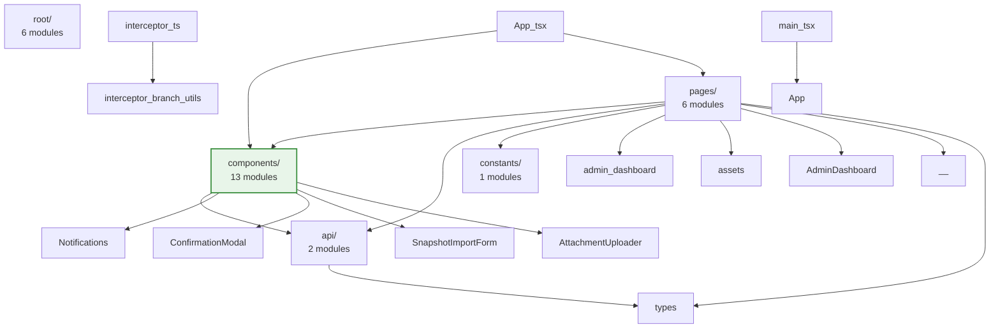
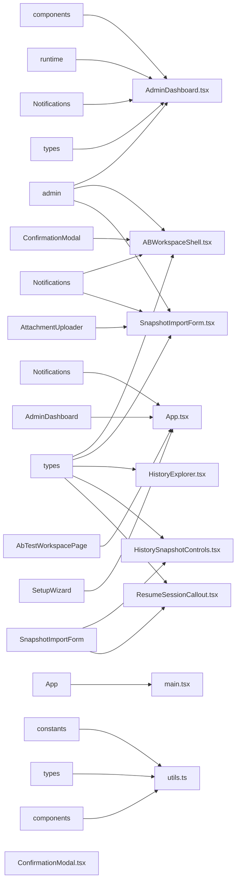

- From `node:http`: `IncomingMessage`
- From `node:crypto`: `default as crypto`
- From `node:querystring`: `default as querystring`

#### `utils/config-store.ts`

**Internal Imports:**

- From `../logger.js`: `logger`
- From `../types.js`: `ImageGenProvider`, `ImageModelId`, `ModelProvider`, `ReasoningMode`

**External Imports:**

- From `conf`: `default as Conf`

#### `utils/cookies.ts`

**External Imports:**

- From `node:http`: `ServerResponse`

#### `utils/credential-store.ts`

**Internal Imports:**

- From `../logger.js`: `logger`

#### `utils/extract-ai-images.ts`

**Internal Imports:**

- From `../types.js`: `GeneratedImage`, `ImageAspectRatio`

#### `utils/frontend-assets.ts`

**Internal Imports:**

- From `../constants.js`: `ADMIN_ROUTE_PREFIX`

**External Imports:**

- From `node:fs`: `existsSync`
- From `node:path`: `dirname`, `resolve`
- From `node:url`: `fileURLToPath`

#### `utils/history-archive.ts`

**Internal Imports:**

- From `./history-export.js`: `createHistorySnapshot`
- From `../types.js`: `BriefAttachment`, `GeneratedImage`, `HistoryEntry`, `HistorySnapshot`

**External Imports:**

- From `jszip`: `default as JSZip`

#### `utils/history-export.ts`

**Internal Imports:**

- From `./sensitive.js`: `maskSensitive`
- From `../types.js`: `BriefAttachment`, `HistoryEntry`, `HistorySnapshot`, `ProviderSettings`, `ProviderSettingsSummary`, `RuntimeConfig`

#### `utils/html-export-transform.ts`

**Internal Imports:**

- From `../image-gen/paths.js`: `getGeneratedImagePath`, `GENERATED_IMAGES_ROUTE`, `RUNTIME_SOURCE_DIR`
- From `../logger.js`: `logger`
- From `./image-reencoder.js`: `reencodeImagesForExport`
- From `../types.js`: `GeneratedImage`

**External Imports:**

- From `node:fs`: `default as fs`
- From `node:path`: `default as path`

#### `utils/html.ts`

_No imports_

#### `utils/image-reencoder.ts`

**Internal Imports:**

- From `../logger.js`: `logger`
- From `../types.js`: `GeneratedImage`

**External Imports:**

- From `sharp`: `default as sharp`

#### `utils/instructions-panel.ts`

**Internal Imports:**

- From `../constants.js`: `ADMIN_ROUTE_PREFIX`, `INSTRUCTIONS_FIELD`
- From `./frontend-assets.js`: `resolveScriptSource`
- From `../types.js`: `BranchLabel`

#### `utils/navigation-interceptor.ts`

**Internal Imports:**

- From `../views/loading-shell/status-messages.js`: `getStatusMessages`
- From `./frontend-assets.js`: `resolveScriptSource`

#### `utils/sensitive.ts`

_No imports_

#### `views/loading-shell.ts`

**Internal Imports:**

- From `./loading-shell/status-messages.js`: `getStatusMessages`
- From `../constants.js`: `LLM_REASONING_STREAM_ROUTE_PREFIX`

**External Imports:**

- From `node:fs`: `existsSync`, `readFileSync`
- From `node:path`: `dirname`, `resolve`
- From `node:url`: `fileURLToPath`

#### `views/loading-shell/assets/hydrate.js`

_No imports_

#### `views/loading-shell/assets/reasoning-stream.js`

_No imports_

#### `views/loading-shell/assets/status-rotation.js`

_No imports_

#### `views/loading-shell/status-messages.ts`

**External Imports:**

- From `node:fs`: `existsSync`, `readFileSync`
- From `node:path`: `dirname`, `resolve`
- From `node:url`: `fileURLToPath`

#### `views/overlay-debug.ts`

**Internal Imports:**

- From `../utils/html.js`: `escapeHtml`
- From `../utils/navigation-interceptor.js`: `getNavigationInterceptorScript`

---

## Frontend (frontend/src/)

**Total Modules**: 28  
**External Packages**: 5

---

### Architecture Overview

---

### Key Module Dependencies

_Top 10 modules by import count_

---

### External Dependencies

#### `react`

Used by 14 module(s)

#### `react-router-dom`

Used by 3 module(s)

#### `react-dom`

Used by 2 module(s)

#### `react-markdown`

Used by 1 module(s)

#### `remark-gfm`

Used by 1 module(s)

---

### Module Import Details

#### `api/admin.ts`

**Internal Imports:**

- From `./types`: `AdminHistoryResponse`, `AdminStateResponse`, `AdminUpdateResponse`

#### `api/types.ts`

_No imports_

#### `App.tsx`

**Internal Imports:**

- From `./components/Notifications`: `NotificationsProvider`
- From `./pages/AdminDashboard`: `default as AdminDashboard`
- From `./pages/AbTestWorkspacePage`: `default as AbTestWorkspacePage`
- From `./pages/SetupWizard`: `default as SetupWizard`

**External Imports:**

- From `react-router-dom`: `BrowserRouter`, `Navigate`, `Route`, `Routes`

#### `components/ABWorkspaceShell.tsx`

**Internal Imports:**

- From `../api/admin`: `discardAbFork`, `fetchAdminState`, `keepAbForkVersion`
- From `./Notifications`: `useNotifications`
- From `../api/types`: `AdminActiveForkSummary`
- From `./ConfirmationModal`: `default as ConfirmationModal`

**External Imports:**

- From `react`: `useCallback`, `useEffect`, `useMemo`, `useRef`, `useState`, `MouseEvent as ReactMouseEvent`

#### `components/AttachmentUploader.tsx`

**External Imports:**

- From `react`: `useCallback`, `useEffect`, `useMemo`, `useRef`, `useState`, `type ChangeEvent`, `type ClipboardEvent`, `type DragEvent`, `type KeyboardEvent`, `type MutableRefObject`, `type ReactNode`

#### `components/ConfirmationModal.tsx`

**External Imports:**

- From `react`: `type ReactNode`, `useEffect`
- From `react-dom`: `createPortal`

#### `components/HistoryExplorer.tsx`

**Internal Imports:**

- From `../api/types`: `AdminHistoryItem`

**External Imports:**

- From `react`: `useCallback`, `useEffect`, `useMemo`, `useRef`, `useState`, `MouseEvent`, `ReactNode`
- From `react-markdown`: `default as ReactMarkdown`
- From `remark-gfm`: `default as remarkGfm`

#### `components/HistorySnapshotControls.tsx`

**Internal Imports:**

- From `../api/types`: `AdminStateResponse`
- From `./SnapshotImportForm`: `default as SnapshotImportForm`

**External Imports:**

- From `react`: `useCallback`, `useEffect`, `useMemo`, `useState`, `DragEvent`, `MouseEvent`

#### `components/ImageModelSelector.tsx`

**External Imports:**

- From `react`: `useMemo`

#### `components/index.ts`

_No imports_

#### `components/ModelInspector.tsx`

**Internal Imports:**

- From `../api/types`: `ModelCompositeScores`, `ModelMetadata`, `ModelReasoningTokens`, `ProviderTokenGuidanceEntry`

**External Imports:**

- From `react`: `forwardRef`, `ChangeEvent`, `ForwardedRef`

#### `components/ModelSelector.tsx`

**Internal Imports:**

- From `../api/types`: `ModelMetadata`, `ProviderTokenGuidanceEntry`

**External Imports:**

- From `react`: `useEffect`, `useMemo`, `useRef`, `useState`

#### `components/Notifications.tsx`

**External Imports:**

- From `react`: `createContext`, `useCallback`, `useContext`, `useEffect`, `useMemo`, `useRef`, `useState`, `type ReactNode`

#### `components/ResumeSessionCallout.tsx`

**Internal Imports:**

- From `../api/types`: `AdminStateResponse`
- From `./SnapshotImportForm`: `default as SnapshotImportForm`

**External Imports:**

- From `react`: `useCallback`, `useState`, `DragEvent`

#### `components/SnapshotImportForm.tsx`

**Internal Imports:**

- From `../api/admin`: `submitHistoryImport`
- From `./AttachmentUploader`: `AttachmentUploader`
- From `./Notifications`: `useNotifications`
- From `../api/types`: `AdminStateResponse`

**External Imports:**

- From `react`: `useCallback`, `useEffect`, `useState`

#### `components/TokenBudgetControl.tsx`

**External Imports:**

- From `react`: `useEffect`, `useMemo`, `useState`

#### `constants/runtime.ts`

_No imports_

#### `instructions-panel.ts`

_No imports_

#### `interceptor-branch-utils.ts`

_No imports_

#### `interceptor.ts`

**Internal Imports:**

- From `./interceptor-branch-utils`: `BRANCH_FIELD`, `resolveActiveBranchId`, `applyBranchToUrl`, `ensureBranchField`

#### `main.tsx`

**Internal Imports:**

- From `./App`: `default as App`

**External Imports:**

- From `react`: `default as React`
- From `react-dom/client`: `default as ReactDOM`

#### `pages/AbTestWorkspacePage.tsx`

**Internal Imports:**

- From `../components/ABWorkspaceShell`: `default as ABWorkspaceShell`

**External Imports:**

- From `react-router-dom`: `Navigate`, `useParams`, `useSearchParams`

#### `pages/admin-dashboard/constants.ts`

**Internal Imports:**

- From `../../components`: `CustomModelConfig`
- From `./types`: `ProviderKey`, `TabKey`

#### `pages/admin-dashboard/types.ts`

**Internal Imports:**

- From `../../api/types`: `AdminStateResponse`

#### `pages/admin-dashboard/utils.ts`

**Internal Imports:**

- From `./constants`: `ADMIN_ROUTE_PREFIX`, `DEFAULT_CUSTOM_MODEL_CONFIG`, `TAB_ORDER`
- From `./types`: `type TabKey`
- From `../../components`: `CustomModelConfig`

#### `pages/AdminDashboard.tsx`

**Internal Imports:**
