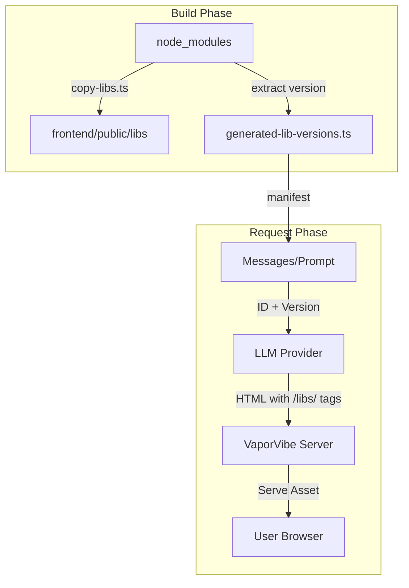

# Content from docs/STANDARD_LIBRARY.md

# VaporVibe Standard Library

VaporVibe includes a **Standard Library** of ~40 popular UI, animation, data visualization, and utility libraries that are available offline. These libraries are automatically managed, version-detected, and presented to the LLM to ensure consistent and high-quality generation.

## How it Works

1. **Build Time**: The `scripts/copy-libs.ts` script runs. It copies assets from `frontend/node_modules` into `frontend/public/libs` and extracts the installed version numbers.
2. **Version Mapping**: It generates `src/config/generated-lib-versions.ts` with a map of package names to versions.
3. **Manifest**: `src/config/library-manifest.ts` defines the metadata for each library (description, tags, injection rule).
4. **Injection**: When generating a page, the server iterates through the manifest and includes the library definitions (including versions) in the system prompt.
5. **Serving**: The backend handles the `/libs/*` route to serve these assets with correct MIME types and caching headers.

## Library Catalog

The following libraries are available for the LLM to use. While none are strictly "forced" into the HTML by the server, the prompt encourages the use of core libraries for consistent quality.

### Core & Reactivity

These libraries are strongly recommended for building the application foundation:

| Library         | Description                                                                              |
| --------------- | ---------------------------------------------------------------------------------------- |
| **TailwindCSS** | Runtime utility classes (v3.4.1). The script is usually pre-included by prompt rules.    |
| **DaisyUI**     | Component classes for Tailwind (`btn`, `card`, `modal`). Use directly in HTML.           |
| **Alpine.js**   | Lightweight reactivity (`x-data`, `x-show`, `x-on:click`). Essential for interactive UI. |
| **HTMX**        | High-power HTML extensions (`hx-get`, `hx-swap`).                                        |
| **Hyperscript** | Scripting for the web (`_='on click...'`). Companion to HTMX.                            |

### CSS Frameworks & UI Kits

Alternative frameworks if the brief specifically requests them:

| Library           | Description                                                 |
| ----------------- | ----------------------------------------------------------- |
| **Bulma**         | Modern CSS framework (`class='button is-primary'`)          |
| **NES.css**       | 8-bit/NES inspired CSS framework (`class='nes-btn'`)        |
| **Pico CSS**      | Minimalist CSS framework (semantic HTML, no classes needed) |
| **Normalize.css** | Modern CSS reset                                            |
| **Hint.css**      | CSS-only tooltips (`class='hint--top' aria-label='...'`)    |

### Animation & Effects

| Library             | Description                                                                |
| ------------------- | -------------------------------------------------------------------------- |
| **Anime.js**        | Powerful animation engine (`anime.animate({ targets: ... })`)              |
| **AOS**             | Animate On Scroll library (`AOS.init()`)                                   |
| **Animate.css**     | Cross-browser CSS animations (`class='animate__animated animate__bounce'`) |
| **Rough Notation**  | Hand-drawn highlights (`RoughNotation.annotate(...)`)                      |
| **Canvas Confetti** | High-performance confetti effects (`confetti()`)                           |
| **Rellax**          | Lightweight parallax library (`new Rellax('.class')`)                      |

### Interactive UI

| Library         | Description                                                |
| --------------- | ---------------------------------------------------------- |
| **SweetAlert2** | Beautiful popup dialogs (`Swal.fire('Hello!')`)            |
| **Toastify**    | Toast notifications (`Toastify({text: 'Hi'}).showToast()`) |
| **Notyf**       | Toast notifications (alternative)                          |
| **Tippy.js**    | Tooltips and popovers (`tippy('#id', {...})`)              |
| **Driver.js**   | Product tours (`driver.js.driver()`)                       |
| **WinBox**      | Window manager (`new WinBox('Title', {...})`)              |
| **Swiper**      | Modern carousel (`<swiper-container>...</swiper-slide>`)   |
| **Sortable.js** | Drag-and-drop sorting (`new Sortable(el, ...)`)            |
| **Hammer.js**   | Touch gestures (`new Hammer(el)`)                          |
| **Hotkeys.js**  | Keyboard shortcuts (`hotkeys('ctrl+a', ...)`)              |

### Forms & Input

| Library       | Description                              |
| ------------- | ---------------------------------------- |
| **Flatpickr** | Datetime picker (`flatpickr('#id', {})`) |
| **Cleave.js** | Format input text (`new Cleave(...)`)    |

### Data & Visualization

| Library        | Description                                       |
| -------------- | ------------------------------------------------- |
| **Chart.js**   | Flexible charting (`new Chart(ctx, ...)`)         |
| **Grid.js**    | Advanced tables (`new gridjs.Grid(...)`)          |
| **Mermaid**    | Diagrams from text (`mermaid.initialize()`)       |
| **Prism.js**   | Syntax highlighting (`Prism.highlightAll()`)      |
| **Marked**     | Markdown rendering (`marked.parse('**Bold**')`)   |
| **KaTeX**      | Fast math typesetting (`katex.render()`)          |
| **Numeral.js** | Number formatting (`numeral(1000).format('0,0')`) |
| **Day.js**     | Date/time library (`dayjs()`)                     |
| **ms**         | Millisecond conversion (`ms('2 days')`)           |

### Graphics & Media

| Library      | Description                                                                |
| ------------ | -------------------------------------------------------------------------- |
| **Three.js** | 3D graphics engine (ESM: `import * as THREE from '/libs/three.module.js'`) |
| **Zdog**     | Round 3D engine (`Zdog`)                                                   |
| **Phaser**   | Professional 2D game engine (`new Phaser.Game({...})`) — Stable v3 API     |
| **Tone.js**  | Web Audio framework (`Tone.Synth`, etc.)                                   |

### Maps & Location

| Library     | Description                      |
| ----------- | -------------------------------- |
| **Leaflet** | Interactive maps (`L.map('id')`) |

### Icons & Graphics

| Library           | Description                                                       |
| ----------------- | ----------------------------------------------------------------- |
| **Lucide**        | Beautiful icons (`lucide.createIcons()`)                          |
| **Minidenticons** | Tiny SVG identicons (`<minidenticon-svg username='...'>`)         |
| **GeoPattern**    | Generate SVG patterns (`GeoPattern.generate('seed').toDataUrl()`) |

### Utilities

| Library               | Description                                         |
| --------------------- | --------------------------------------------------- |
| **FileSaver**         | Client-side file saving (`saveAs(blob, 'name')`)    |
| **Typewriter Effect** | Typewriter animation (`new Typewriter('#id', ...)`) |

### Fonts

| Font                 | Description                                           |
| -------------------- | ----------------------------------------------------- |
| **Inter**            | `font-family: 'Inter'` — Modern Sans (Default)        |
| **JetBrains Mono**   | `font-family: 'JetBrains Mono'` — Code/monospace      |
| **Press Start 2P**   | `font-family: 'Press Start 2P'` — 8-bit retro         |
| **Playfair Display** | `font-family: 'Playfair Display'` — Serif             |
| **Roboto**           | `font-family: 'Roboto'` — Clean sans-serif            |
| **Poppins**          | `font-family: 'Poppins'` — Geometric sans-serif       |
| **Fira Code**        | `font-family: 'Fira Code'` — Monospace with ligatures |
| **Lora**             | `font-family: 'Lora'` — Upscale Serif                 |
| **Merriweather**     | `font-family: 'Merriweather'` — Serif                 |
| **Montserrat**       | `font-family: 'Montserrat'` — Modern Sans             |
| **Oswald**           | `font-family: 'Oswald'` — Condensed Sans              |
| **Raleway**          | `font-family: 'Raleway'` — Elegant Sans               |
| **DM Sans**          | `font-family: 'DM Sans'` — Modern SaaS body           |
| **Manrope**          | `font-family: 'Manrope'` — Techy Headings             |
| **Space Grotesk**    | `font-family: 'Space Grotesk'` — Futuristic Headings  |
| **IBM Plex Sans**    | `font-family: 'IBM Plex Sans'` — Enterprise / B2B     |

## Adding a New Library

1. **Install with NPM**: Run `npm install --prefix frontend <package-name>`.
2. **Update Copy Script**: Add the library to `NPM_MAPPING` in `scripts/copy-libs.ts`.
   - If it needs subfolders (like images/fonts), add a special case in the `main` function.
3. **Update Manifest**: Add the library entry to `VAPORVIBE_LIBRARIES` in `src/config/library-manifest.ts`.
4. **Rebuild**: Run `npm run copy:libs`.

## Offline Usage

All libraries are served from the local `/libs/` route. This ensures VaporVibe works entirely offline (once models are cached or if using a local provider) and prevents dependency on external CDNs for the generated apps.

## LLM Awareness

The LLM is explicitly informed of the *exact* library versions installed. This prevents the model from hallucinating API methods that don't exist in the current version or using outdated patterns.

## Key Design Decisions

### DaisyUI as Primary CSS Framework

**DaisyUI v4** is the recommended component library because:
- It provides semantic component classes (`btn`, `card`, `modal`) that keep HTML clean
- It pairs perfectly with the **Tailwind CSS** script for utility classes (`flex`, `p-4`)
- It offers a rich set of pre-designed components without enforcing a specific JS framework
- It simplifies creating modern, responsive interfaces quickly

### Phaser Instead of Kaboom/Kaplay

**Phaser v3** replaced Kaboom/Kaplay for game development because:
- Phaser's API has been **stable since ~2018**—LLMs know it perfectly
- Kaboom v3000 introduced breaking API changes that LLMs often hallucinate incorrectly
- Phaser generates **almost always correct code** with minimal hallucination
- Ships as a single browser-ready file (`phaser.min.js`)

