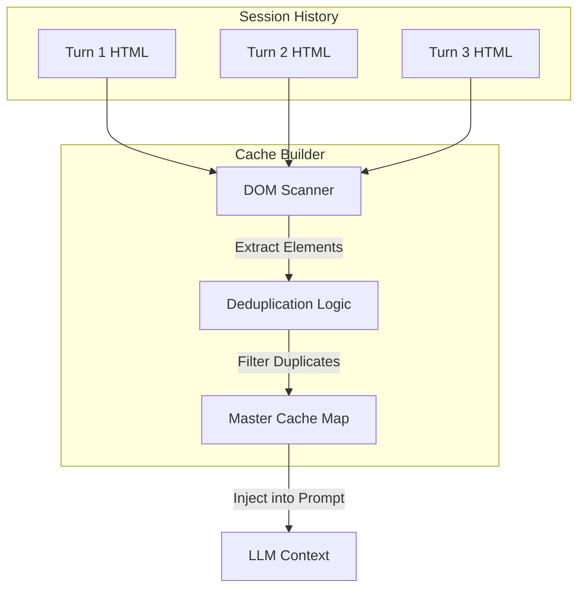

# Content from docs/architecture/token-optimization.md

# Architecture: Token Optimization (Component Cache)

> **Scope**: Explains the caching system used to reduce LLM token costs by reusing HTML fragments.

## Purpose
LLMs charge by the token. Regenerating the same CSS, Header, and Footer for every single page view is wasteful and slow. The Component Cache allows the LLM to reference these blocks by ID instead of rewriting them.

## Core Concepts

### 1. Identification
The server scans generated HTML for "structural" elements:
-   Tags: `header`, `footer`, `nav`, `main`, `style`, `script`.
-   Action: Assigns a stable `data-id` (e.g., `sl-gen-1`) to each.

### 2. The Contract
We tell the LLM: "You don't need to write the header again. Just write `{{component:sl-gen-1}}`."
-   **Prompt**: The system prompt includes a list of available component IDs and their signatures (e.g., "Header with Nav").
-   **Generation**: The LLM outputs HTML with placeholders.

### 3. Master Cache Construction

### 4. ID Derivation Logic (Hashing)
To ensure stability across turns, we don't just use random IDs.
-   **Hashing**: We hash the *content* of the element (minus whitespace).
-   **Mapping**: `Hash(Content) -> sl-gen-X`.
-   **Stability**: If the LLM generates the exact same header in Turn 5 as in Turn 1, it gets the same ID.
-   **Scope**: IDs are stable **within a session**. However, if the server restarts, the `SessionStore` (in-memory) is cleared, and the ID counter resets. This means `sl-gen-1` in Session A might be different from `sl-gen-1` in Session B.

### 5. Resolution Flow
Before sending the HTML to the browser, the server:
1.  Parses the LLM output.
2.  Finds all `{{component:...}}` and `{{style:...}}` placeholders.
3.  Substitutes them with the full cached markup.

## Key Files
-   **Logic**: `src/server/component-cache.ts`
-   **Integration**: `src/server/server.ts` (See `buildMasterReusableCaches`)

