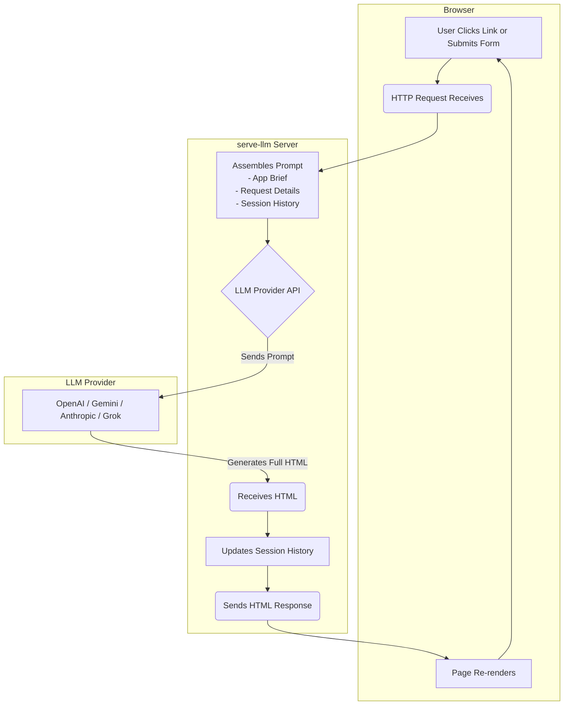

# Agent Onboarding Guide: serve-llm

Welcome! This guide provides the high-level context, architectural details, and philosophical principles needed to understand and contribute to the `serve-llm` repository. 🤖

---

## 1. Core Concept & Purpose

`serve-llm` is a "vibe non-coding" experiment where an LLM improvises an entire interactive web application on every request based on a simple, natural language **brief**.

- **Primary Goal**: To function as a "rapid-prototyping cheat code," allowing you to validate a UX flow or interaction idea without writing any frontend or backend code.
- **Core Philosophy**: It's an "intentionally unserious" and "cheeky thought experiment". The joy is in watching the model "make it up as it goes," embracing the creative chaos of generative AI.
- **Key Feature**: It supports multiple LLM providers (OpenAI, Google Gemini, Anthropic, and xAI Grok), allowing you to see how different models interpret the same brief.

---

## 2. High-Level Architecture & Request Flow

The system operates on a simple, stateless request-response cycle that heavily involves an external LLM provider.

### The Vibe-Driven Request Cycle 🌀

This is the main loop for rendering application pages once the server is configured.

1.  A user action in the browser sends an HTTP request to the `serve-llm` server.
2.  The server assembles a detailed prompt containing the app brief, request details, and session history.
3.  This prompt is sent to the configured LLM provider's API.
4.  The LLM generates a complete, self-contained HTML document.
5.  The server receives the HTML, updates the session history, and sends it back to the browser.

### The Setup & Configuration Flow ✨

When first launched, the server guides the user through a browser-based setup wizard.

1.  The CLI launches the server and opens a browser to `http://localhost:3000`.
2.  The wizard prompts the user to select a provider and enter an API key.
3.  The server verifies the key against the provider's API.
4.  The user then enters the initial application **brief**.
5.  Once submitted, the app opens in a new tab, and the original tab becomes the React-powered admin console served from the same SPA shell.

### The Admin Console Flow 🕹️

The admin console at `/serve-llm` is a React SPA (built in `frontend/`) that serves as the control center for the live application.

- **Live Controls**: You can tweak the global brief, adjust history limits, and manage providers without restarting the server.
- **History Explorer**: It allows you to inspect every generated page, including token usage stats, raw HTML, and model reasoning traces.
- **Import/Export**: You can export the entire session as a JSON file or a prompt-friendly Markdown file and later import it to restore the state.

---

## 3. Design Language & UX Philosophy

This is not a traditional software project; it's a creative tool. The "vibe" is as important as the function.

### Guiding Principles ("The Vibe")

- **Improvised & Playful**: Embrace the "chaos" of the LLM's creativity. Slight variations between renders are a feature, not a bug. The goal is to watch the model "improvise".
- **High-Fidelity Prototyping**: The generated output should look and feel like a real application, using convincing, non-placeholder data to make the experience feel complete.
- **Delightful & Modern**: The system prompt explicitly asks the LLM to craft a "gorgeous, modern UX" with "joyful" and "accessible" interactions.

### Visual & Interaction Design

- **Aesthetics**: The tool's own UI favors a clean, modern look with soft shadows, gradients, and playful animations (e.g., "liquid glass," "wobbly drop morph"). This aesthetic should inspire the generated output.
- **Latency as an Experience**: Server round-trips are slow (30s to 3m). The project turns this wait into part of the experience with entertaining loading animations ("DVD screensaver drift," "Mini rally") and a long list of whimsical status messages to keep the user engaged.
- **Micro-interactions**: To manage the high latency, simple in-page interactions (like toggling a modal) should be handled with inline client-side JavaScript without a server request.
- **Major Navigations**: Any action requiring a change in core data **must** trigger a full page reload via a standard `<a>` link or `<form>` submission.

---

## 4. Core Mechanisms & Technical Details

### The Core Prompt

- **Location**: The logic for building the prompt is centralized in `buildMessages()` within `src/llm/messages.ts`.
- **Compilation**: The function assembles a `system` message (a detailed set of rules) and a `user` message (the dynamic context).
- **Content**:
  - **System Prompt**: Contains mandatory rules like "SELF-CONTAINED HTML," "NO SPA ROUTING," and "STATE HANDOFF".
  - **App Brief**: The user-defined goal for the application.
  - **Context**: The current HTTP request details, the full HTML of the _previous_ page, and a curated session history.

### Navigation Interception

- **Purpose**: To prevent a blank white screen during the long LLM generation time by showing a loading overlay.
- **Mechanism**: A script from `/__serve-llm/interceptor.js` is injected into every response. It intercepts clicks and form submissions, shows an overlay, and then re-initiates the request with a special marker (`__serve-llm=interceptor`). The server uses this marker to send back the final HTML directly.

### Special Server Routes

- `/__setup`: Main route for the setup wizard UI (served by the SPA shell).
- `/__setup/verify-key`: `POST` endpoint for verifying a new API key.
- `/__set-brief`: `POST` endpoint for submitting the initial app brief.
- `/serve-llm/*`: Prefix for the Admin Console, handled by the `AdminController` and rendered by the SPA.
- `/__serve-llm/interceptor.js`: Serves the navigation interception script.
- `/__serve-llm/result/{token}`: A temporary, single-use route for fetching generated HTML asynchronously.

---

## 5. Repository Structure & Key Files

- `src/index.ts`: The main CLI entry point that starts the server.
- `src/server/server.ts`: The core HTTP server logic, request routing, and state management.
- `src/server/admin-controller.ts`: Handles all logic for the `/serve-llm` admin dashboard API.
- `src/config/runtime-config.ts`: Central logic for resolving configuration from all sources.
- `src/llm/messages.ts`: **Crucial file**. Contains the `buildMessages` function for core prompt engineering.
- `src/llm/factory.ts`: A factory that creates the appropriate LLM client based on configuration.
- `src/utils/credential-store.ts`: Implements secure API key storage using the OS keychain.
- `src/utils/navigation-interceptor.ts`: Generates the client-side JavaScript for the navigation overlay.
- `frontend/`: React + Vite admin/setup SPA. `frontend/src/pages/SetupWizard.tsx` and `frontend/src/pages/AdminDashboard.tsx` define the main routes; `frontend/dist/` is served by the backend in production.

---

## 6. Development & Areas for Caution

### Operational Details

- **Environment**: Requires **Node.js v24+**.
- **Development**: Run `npm run dev` to launch both the backend watcher (`tsx --watch`) and the Vite dev server for the React admin SPA. Use `npm run dev:be` and `npm run dev:fe` to focus on one side.
- **Building**: The compiled `dist/` directory is committed to the repository. **You must run `npm run build` before committing changes.** The build step also invokes `npm run build:fe` so `frontend/dist/` stays current.
- **Error Handling**: The application uses graceful degradation. For instance, if the OS keychain is unavailable, it falls back to in-memory credential storage for the session without crashing.
- **Security & Logging**: The server binds to `127.0.0.1` by default for security. Set the `LOG_LEVEL=debug` environment variable to see detailed prompts, reasoning traces, and token counts.

### Areas for Caution ⚠️

- **No Automated Tests**: The repository lacks an automated test suite. All changes require careful manual smoke testing.
- **macOS-Centric Builds**: The `scripts/` directory is heavily focused on building a polished macOS `.app` bundle. This is a complex, platform-specific area.
- **Inconsistent "Reasoning" API**: OpenAI/Grok use a `reasoningMode` string, while Anthropic/Gemini use a `reasoningTokens` budget. Be mindful of this when working with provider settings.
- **Embrace the Chaos**: An agent's goal is to guide the LLM's creativity, not to force deterministic output. Do not try to "fix" the natural, slight variations between renders.

---

## 7. How To... (Common Agent Tasks)

### ...Add a New LLM Provider

1.  **Create Client**: In `src/llm/`, create a new `your-provider-client.ts` that implements the `LlmClient` interface.
2.  **Update Factory**: Add the new client to the factory function in `src/llm/factory.ts`.
3.  **Add Verification**: Create a verification function and add it to `src/llm/verification.ts`.
4.  **Update Types & Constants**: Add the provider to the `ModelProvider` type in `src/types.ts` and its details to `src/constants/providers.ts`.
5.  **Update Config**: In `src/config/runtime-config.ts`, add logic to detect the new provider's API key from environment variables.

### ...Adjust the Core Prompt

- All prompt engineering logic is centralized in `src/llm/messages.ts`.
- To change the LLM's core instructions, modify the `systemLines` array in the `buildMessages` function.
- To change how dynamic context is presented, modify the `user` string template in the same function.

### Coding Style and Conventions

The new guide completely omits any mention of the project's coding standards. An agent needs these rules to write code that is consistent with the existing repository.

- **Language and Configuration**: The project uses **TypeScript** with `strict` typing enabled and expects **NodeNext** module syntax (e.g., `import … from "./module.js"`).
- **Code Formatting**: The standard is **2-space indentation** and using **trailing commas** in multi-line literals.
- **Naming Conventions**: Contributors should use descriptive function names (like `resolveAppConfig`) and keep files focused on a single responsibility.
- **Constants**: Shared literal values, such as paths and environment variable keys, should be centralized in `src/constants.ts`.

### Detailed Development Commands and Environment Variables

The new guide mentions `npm run dev` and `npm run build`, but it misses several other commands and important environment variables used for debugging and development.

- **Node.js Version**: Development must be done using Node.js v24.x, enforced by running `nvm use`.
- **Running Compiled Code**: The `npm run start` script is available to run the compiled output from the `dist/` directory.
- **Logging Control**: The logger's verbosity is controlled by the `LOG_LEVEL` environment variable (`debug`, `info`, etc.). For scripting, colorized logs can be disabled with `PINO_PRETTY=false`.
- **Reasoning Flags**: Reasoning behavior can be fine-tuned during development using the `--reasoning-mode` and `--reasoning-tokens` command-line flags.
- **UI Toggles**: The floating AI Assist panel can be hidden for demos using `--instructions-panel off`.

### Testing Strategy

While the new guide correctly states there are no automated tests, it omits the project's required manual testing procedure.

- **Manual Smoke Testing**: Before submitting changes, developers must manually test the application with each of the main providers by setting the `OPENAI_API_KEY`, `GEMINI_API_KEY`, or `ANTHROPIC_API_KEY` environment variables and running `npm run dev` to exercise the UI and core flows.
- **Future Test Location**: When automated tests are added, they should be co-located with the source files in a `__tests__` directory.
