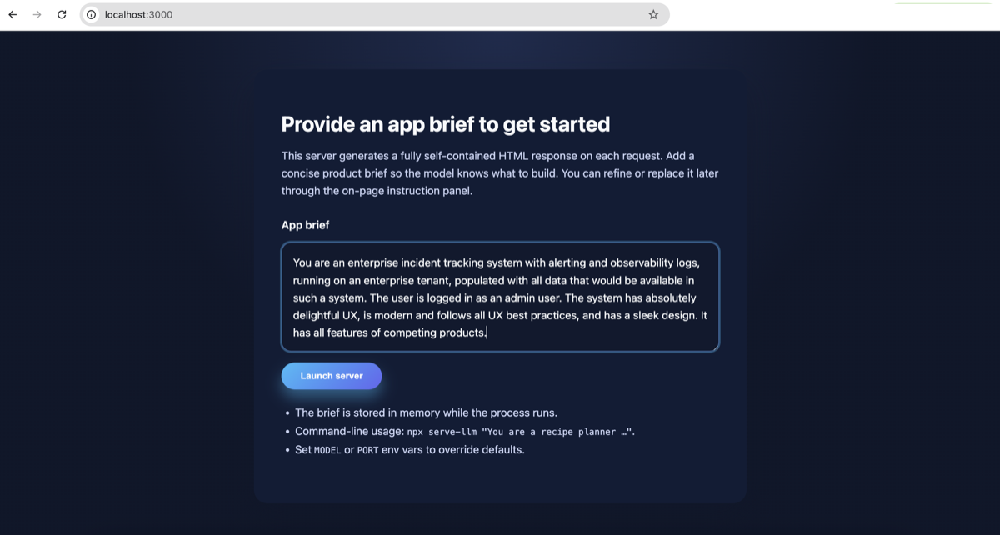
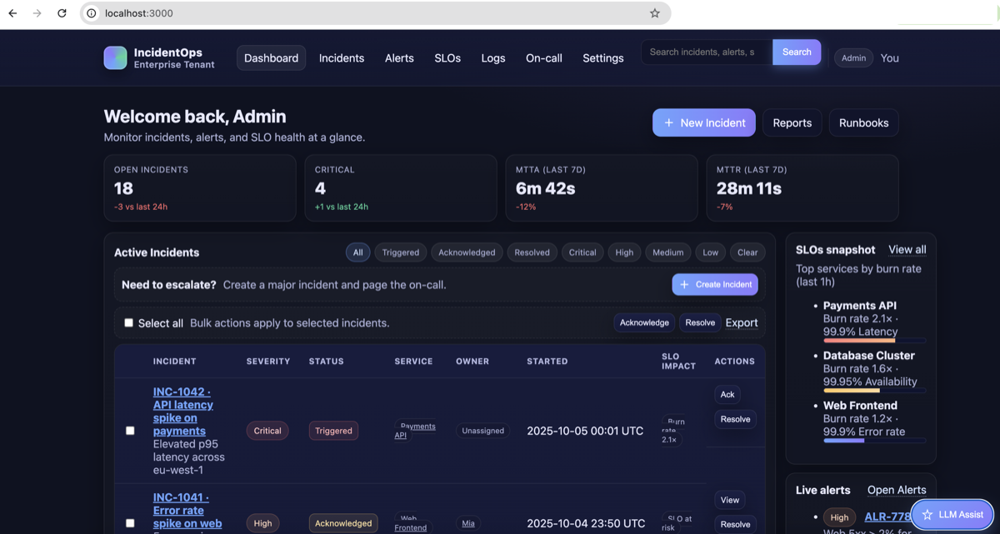
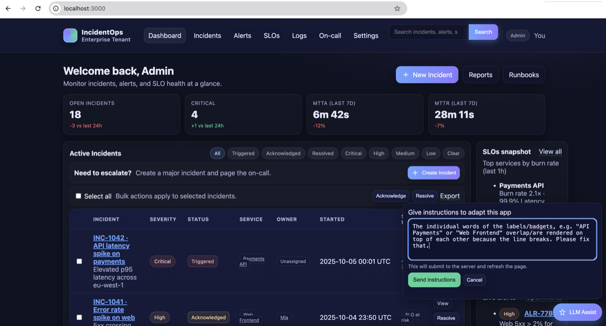
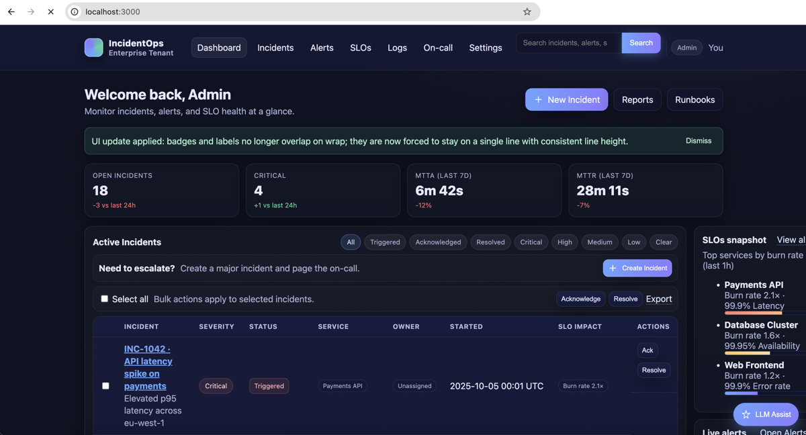
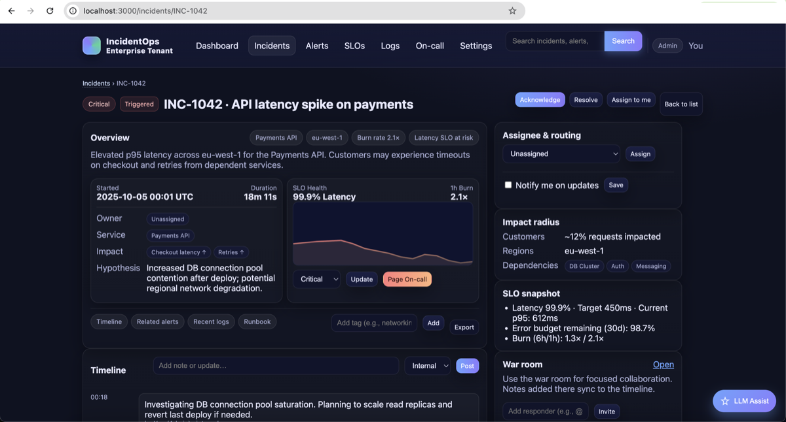

# serve-llm

Serve-llm is a cheeky thought experiment, not a production stack: instead of vibe-coding a frontend and backend, you picture the page you want and let an LLM improvise the entire view—markup, copy, flow—on every request. The CLI (`npx serve-llm`) keeps only the last HTML around, so each navigation is a fresh act of hallucination with full interactivity. It’s intentionally unserious; half the joy is watching the model make it up as it goes.

It’s also a rapid-prototyping cheat code: why spend a weekend wiring a throwaway backend and pixel-tweaking a frontend just to sanity-check a UX flow or study a short interaction? Let the model “predict” what the app would render—if it quacks like a duck, that might be enough to validate the idea before investing real build time.

## Quick Start

- Install prerequisites: Node.js ≥ 20 (use `.nvmrc`) and an API key for OpenAI, Gemini, or Anthropic.
- Launch immediately: `npx github:gerkensm/serve-llm "You are a mood journal"`.
- Prefer Gemini or Anthropic? Set `GEMINI_API_KEY` / `ANTHROPIC_API_KEY` or pass `--provider gemini` / `--provider anthropic`.
- Want model "thinking"? Pass `--reasoning-mode medium --reasoning-tokens 2048` for supported providers.
- Hate the floating instruction bar? Disable it with `--instructions-panel off` (default is on).
- No brief on the CLI? Visit `http://localhost:3000` and drop one into the starter form.

## Demo Walkthrough: Enterprise Incident Tracker (Screenshots)

Experience how the loop feels in practice with a fabricated "enterprise incident tracker" brief. Click any thumbnail to view the full-resolution capture.

| Step | Preview | What happened |
| --- | --- | --- |
| 1 |  | The CLI launches the brief form at `http://localhost:3000`, where the enterprise incident-tracker prompt is pasted into the textarea before starting the session. |
| 2 |  | The landing view loads with a richly styled overview of active incidents, but a styling glitch causes the incident badges to overlap when they wrap. |
| 3 |  | Using the floating `AI Assist` panel, the admin submits a fix request describing the badge overlap issue. |
| 4 |  | The regenerated page applies the patch: badges now stay on a single line, and an inline note confirms the change the model just made. |
| 5 |  | Clicking an incident ID (INC-1042) opens a fully fabricated detail view that keeps the theme, data tone, and interaction model consistent with the overview. |

### Prompt Ideas

- **Plausible Web Replica** – `You are a website simulator. Inspect the request path for a URL (e.g. /wikipedia.com or /https://wikipedia.com) and render a believable page exactly as if you operated that domain. Recreate navigation, copy, and structure the site would plausibly contain. When adding links, always emit URLs routed through yourself so the next turn can “browse” correctly. Never acknowledge this is synthetic—commit fully to the fiction.`
- **Delightful Shopping Lists** – `You are a multi-list shopping companion with gorgeous, modern UX. Persist user data by resubmitting every list and item with each response. Support creating, renaming, and checking off items across multiple lists, and keep interactions accessible and joyful.`

## What Makes It Weird

- No stateful backend logic beyond the last HTML snapshot; every navigation is freshly reimagined, so routes and flows stay delightfully unstable.
- The LLM must ad-lib both markup and UX per request, yielding an improv-style experience where the “app” keeps reinventing itself.
- Server constraints enforce single-view, self-contained HTML—no external assets, no SPA sleight-of-hand.

## How It Works

- TypeScript orchestrates the CLI, config resolution, session store, and provider adapters (`openai`, `@google/genai`, `@anthropic-ai/sdk`).
- Each request funnels through a strict prompt, handing over the brief, current route, submitted form data, and the previously generated HTML.
- Sessions are cookie-scoped and capped; the only persisted context is the latest HTML string per session.
- CLI flags (`--reasoning-mode`, `--reasoning-tokens`) let you opt into OpenAI reasoning effort or Anthropic "thinking" budgets on demand.

## Developing

- `nvm use` → `npm install` → `npm run dev` for TypeScript live-reloading, or `npm run build` to refresh the distributable in `dist/`.
- Update prompts and helpers under `src/`; the CLI entry lives in `src/index.ts`.
- Dist output stays committed so `npx` consumers get a frictionless run.
- Set `LOG_LEVEL` (default `debug` in dev, `info` in prod) to control Pino log verbosity; override `PINO_PRETTY=false` if you prefer plain JSON.
- When reasoning/thinking is enabled, check the debug logs for provider-specific summaries and reasoning token usage.

## Safety & Secrets

- Store API keys in `.env` (gitignored) or export them per shell session; include optional `REASONING_MODE` / `REASONING_TOKENS` there if you want defaults.
- Set `INSTRUCTION_PANEL=off` to remove the floating LLM instruction bar globally.
## Why Bother

This project is a thought experiment in “non-vibe coding”: hold the UI in your head, let the LLM hallucinate the page, and embrace the chaos that follows when the model riffs on every route. It is intentionally unserious—and surprisingly fun.
