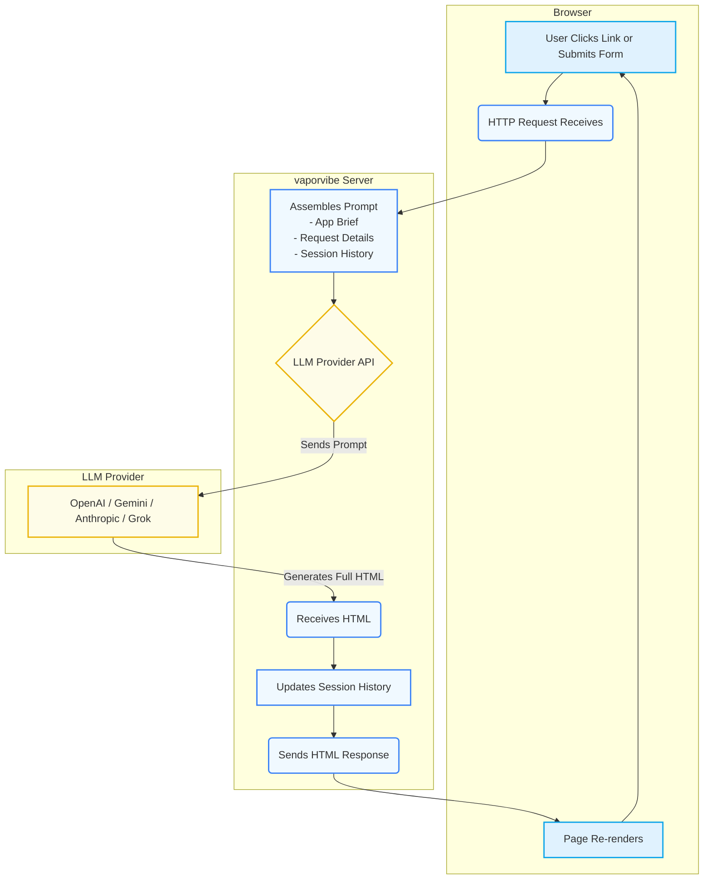

# VaporVibe

A web server that pretends to be the app you dream up, without building it.

Instead of vibe-coding a frontend and backend, you picture the page you want and let an LLM improvise the entire view—markup, copy, flow—on every request. The server keeps a rolling history per session which is fed to LLM on every request, so each navigation is still a fresh act of hallucination with full interactivity. Hlf the joy is watching the model make it up as it goes.

It’s also a rapid-prototyping cheat code: why spend a weekend wiring a throwaway backend and pixel-tweaking a frontend just to sanity-check a UX flow or study a short interaction? Let the model “predict” what the app would render -- if it quacks like a duck, that might be enough to validate the idea before investing real build time.


---

## Get Started in 60 Seconds 🚀

All you need is **Node.js (v20+, ideally 24)** and an API key from OpenAI, Google Gemini, Anthropic, or xAI Grok.

1.  **Launch the server:**
   If you are on Mac OS (Apple Silicon), grab the DMG here: https://github.com/gerkensm/vaporvibe/releases/tag/1.2.1
   For other platforms, there are no binaries yet. Start:
    ```bash
    npx github:gerkensm/vaporvibe
    ```

2.  **Follow the wizard:**
    The command opens a setup wizard in your browser at `http://localhost:3000`. Just pick your provider, drop in your API key, and write your first brief. That's it. The app will open in a new tab, and the original tab becomes your admin console.

<details>
<summary><strong>Prefer the command line?</strong></summary>

- **Pass a brief directly:** `npx github:gerkensm/vaporvibe "You are a mood journal"`
- **Choose a provider:** Use `--provider <openai|gemini|anthropic|grok>` or set an environment variable (`OPENAI_API_KEY`, `GEMINI_API_KEY`, `ANTHROPIC_API_KEY`, or `XAI_API_KEY`/`GROK_API_KEY`).
- **Override the model:** Use `--model <model-identifier>` to pick a specific variant, like `grok-3-mini`.
- **Tune history:** Use `--history-limit` and `--history-bytes` to control how much context is fed back to the model.
- **Change the port:** Use `--host <address>` and `--port <number>` to bind the server elsewhere.

</details>

---

## Demo: From Brief to Interactive App

Watch how a single brief turns into an improv UI loop. The model invents a note taking app from scratch, gets feedback via the Iterations panel to add features, and then hallucinates consistent interactions on the fly.

https://github.com/user-attachments/assets/176c463f-4919-44b2-9193-94ccde51610c

---

# The Vibe-Driven Request Cycle

<details>
<summary><strong>View the request cycle diagram</strong></summary>



</details>

---

## Features

- **Truly No-Code:** No frontend framework, no backend logic. The LLM improvises the entire interactive experience on every click.
- **Multi-Provider Playground:** Swap between OpenAI, Google Gemini, Anthropic, and xAI Grok on the fly. See how different models interpret the same brief.
- **Brief Attachments:** Ground the vibe with reference images or PDFs. Upload them in the admin console, and multimodal models ingest the inline assets while everyone else gets a Base64 summary—everything is preserved in history and exports for easy hand-off.
- **Effortless Setup:** Forget config files. A slick browser-based wizard gets your API key and initial brief configured in moments.
- **AI-Powered Hot-Fixes:** Use the floating AI Assist panel to give the model live feedback. "Make the buttons rounder" or "Fix this layout bug"—and watch it regenerate the page.
- **Model "Thinking" Traces:** Enable reasoning mode to see the model's chain-of-thought, giving you a peek into how it decided to render the page.

---

## How We Keep Token Costs (Relatively) Reasonable

Hallucinating whole apps could get pricey fast, so the runtime pulls a few sleights of hand to keep the model's context lean without ruining the vibe:

- **Virtual REST API (a.k.a. "Sure, Data Exists")** – The generated HTML can call `/rest_api/query/*` or `/rest_api/mutation/*` like a real backend. The brain-twist: the server already knows what structure the UI expects, so it simply replies with JSON in the perfect shape—no schema migrations, no surprises. Mutations get echoed back into the prompt so the model "remembers" state changes, and queries give it rich data without re-synthesizing giant tables every render.
- **Reusable Component Placeholders** – After each response the server sprinkles `data-id`s onto `<html>`, `<head>`, `<body>`, headers, nav, helper scripts, and `<style>` blocks. On the next pass, the LLM can just write `{{component:sl-gen-12}}` or `{{style:sl-style-3}}` to pull cached markup back in. Chrome, global styles, and static scripts stay consistent while costing almost zero tokens.
- **History Time Travel** – Because those caches live with each history entry, the model can resurrect an earlier page wholesale when nothing changed—sometimes the entire response is a single `<html>` placeholder. (It still looks like sorcery when it works.)

It’s not bulletproof, but these tricks keep the improvisation fast enough to feel interactive.

---

## The Admin Console is Your Cockpit

Once your app is running, the admin interface at `/vaporvibe` becomes your mission control. It's packed with tools for steering the creative chaos:

- **Live Controls:** Tweak the global brief, adjust history limits, or toggle the AI Assist panel without restarting the server.
- **Provider Management:** Switch between OpenAI, Gemini, Anthropic, and xAI Grok. Change models or update API keys with a few clicks.
- **History Explorer:** Inspect every generated page with expandable reasoning traces, token usage stats, and raw HTML output.
- **Session Time-Travel & Export:** Download the entire session as a JSON snapshot to save your work, then drag-and-drop it back in to restore the exact state. You can also export a `prompt.md` file—a perfect, human-readable blueprint of your app's flow, ready to hand off to an agent as a basis for real development.

---

## Prompt Ideas

- **Plausible Web Replica** – `You are a website simulator. Inspect the request path for a URL (e.g. /wikipedia.com) and render a believable page as if you operated that domain. Recreate navigation, copy, and structure. Route all links through yourself so the next turn can “browse” correctly. Never acknowledge this is synthetic—commit fully to the fiction.`
- **Delightful Shopping Lists** – `You are a multi-list shopping companion with gorgeous, modern UX. Persist user data by resubmitting every list and item with each response. Support creating, renaming, and checking off items across multiple lists, and keep interactions accessible and joyful.`

---

## Developing

1.  `nvm use` (Node 24.x) → `npm install` to grab dependencies.
2.  Run `npm run dev` for a dual-server watch mode:
    - The backend runs via `tsx --watch` from `src/index.ts`.
    - The React admin/Setup SPA (under `frontend/`) is served by Vite on port 5173 and proxied through the Node server.
3.  Visit `http://localhost:3000/__setup` for the onboarding wizard or `http://localhost:3000/vaporvibe` for the admin console.

Additional scripts:

- `npm run dev:fe` / `npm run dev:be` to focus on the frontend or backend individually.
- `npm run build:fe` to emit the production `frontend/dist/` bundles.
- `npm run build` to compile both the backend (`dist/`) and the React assets—run this before committing so the checked-in bundles stay fresh.

Tips:

- Core server logic (prompting, routing, providers) still lives in `src/` with `src/index.ts` as the CLI entry point.
- The `dist/` output stays committed for the published CLI; `frontend/dist/` is likewise generated and served by the backend.
- Set `LOG_LEVEL` (`debug`, `info`, `warn`) to adjust logging verbosity while iterating.

### Linux Build Requirements

For secure credential storage (keytar), Linux systems need `libsecret` for native compilation:

```bash
# Ubuntu/Debian
sudo apt-get install libsecret-1-dev

# Fedora/RHEL
sudo dnf install libsecret-devel

# Arch
sudo pacman -S libsecret
```

If `libsecret` is unavailable, `npm install` may fail to compile keytar's native bindings. The app will still work with a graceful fallback to memory-only credential storage.

---

## Why Bother?

This project is a thought experiment in “vibe non-coding”: hold the UI in your head, let the LLM hallucinate the page, and embrace the chaos that follows when the model riffs on every route. It is intentionally unserious—and surprisingly fun.
