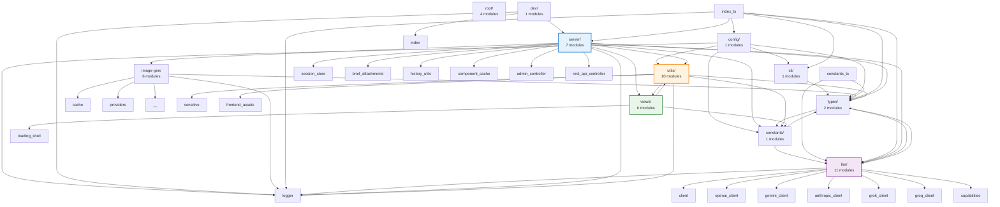
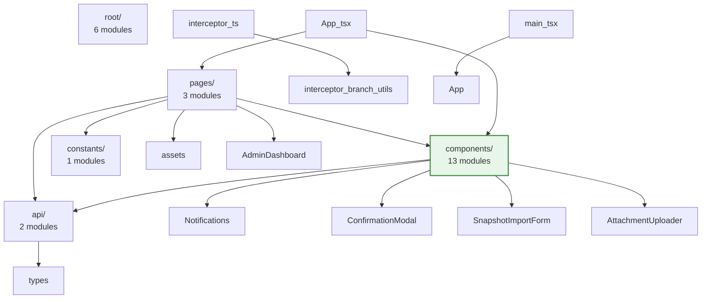
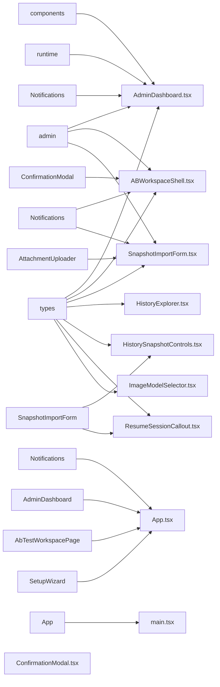

```mermaid
graph LR
  server_server_ts["server.ts"]
  ___constants_js["constants"] --> server_server_ts
  ___constants_providers_js["providers"] --> server_server_ts
  ___llm_messages_js["messages"] --> server_server_ts
  ___llm_capabilities_js["capabilities"] --> server_server_ts
  ___utils_cookies_js["cookies"] --> server_server_ts
  server_admin_controller_ts["admin-controller.ts"]
  ___constants_js["constants"] --> server_admin_controller_ts
  ___constants_providers_js["providers"] --> server_admin_controller_ts
  ___llm_factory_js["factory"] --> server_admin_controller_ts
  ___llm_verification_js["verification"] --> server_admin_controller_ts
  ___utils_body_js["body"] --> server_admin_controller_ts
  server_rest_api_controller_ts["rest-api-controller.ts"]
  ___llm_capabilities_js["capabilities"] --> server_rest_api_controller_ts
  ___llm_messages_js["messages"] --> server_rest_api_controller_ts
  ___utils_cookies_js["cookies"] --> server_rest_api_controller_ts
  ___utils_body_js["body"] --> server_rest_api_controller_ts
  __history_utils_js["history-utils"] --> server_rest_api_controller_ts
  index_ts["index.ts"]
  __cli_args_js["args"] --> index_ts
  __config_runtime_config_js["runtime-config"] --> index_ts
  __llm_factory_js["factory"] --> index_ts
  __server_session_store_js["session-store"] --> index_ts
  __server_server_js["server"] --> index_ts
  dev_backend_dev_server_ts["backend-dev-server.ts"]
  ___logger_js["logger"] --> dev_backend_dev_server_ts
  ___index_js["index"] --> dev_backend_dev_server_ts
  ___server_server_js["server"] --> dev_backend_dev_server_ts
  ___server_session_store_js["session-store"] --> dev_backend_dev_server_ts
  llm_factory_ts["factory.ts"]
  __openai_client_js["openai-client"] --> llm_factory_ts
  __gemini_client_js["gemini-client"] --> llm_factory_ts
  __anthropic_client_js["anthropic-client"] --> llm_factory_ts
  __grok_client_js["grok-client"] --> llm_factory_ts
  __groq_client_js["groq-client"] --> llm_factory_ts
  config_runtime_config_ts["runtime-config.ts"]
  ___constants_js["constants"] --> config_runtime_config_ts
  ___utils_credential_store_js["credential-store"] --> config_runtime_config_ts
  ___utils_config_store_js["config-store"] --> config_runtime_config_ts
  ___logger_js["logger"] --> config_runtime_config_ts
  ___types_js["types"] --> config_runtime_config_ts
  llm_verification_ts["verification.ts"]
  __openai_client_js["openai-client"] --> llm_verification_ts
  __gemini_client_js["gemini-client"] --> llm_verification_ts
  __anthropic_client_js["anthropic-client"] --> llm_verification_ts
  __grok_client_js["grok-client"] --> llm_verification_ts
  __groq_client_js["groq-client"] --> llm_verification_ts
  llm_groq_client_ts["groq-client.ts"]
  ___logger_js["logger"] --> llm_groq_client_ts
  __capabilities_js["capabilities"] --> llm_groq_client_ts
  ___types_js["types"] --> llm_groq_client_ts
  __client_js["client"] --> llm_groq_client_ts
  server_session_store_ts["session-store.ts"]
  ___utils_cookies_js["cookies"] --> server_session_store_ts
  ___utils_html_js["html"] --> server_session_store_ts
  ___types_js["types"] --> server_session_store_ts
```

# Codebase Import/Export Map

> **Auto-generated documentation for LLM context**  
> Last updated: 2025-12-18T03:14:04.029Z  
> Generated by: `npm run gen:codebase-map`

This document provides detailed import/export relationships, showing which specific symbols (functions, classes, types, variables) are imported by each module.

---

## Backend (src/)

**Total Modules**: 50  
**External Packages**: 19

---

### Architecture Overview



---

### Key Module Dependencies

_Top 10 modules by import count_



---

### External Dependencies

#### `node:url`

Used by 7 module(s)

#### `node:path`

Used by 6 module(s)

#### `node:fs`

Used by 5 module(s)

#### `openai`

Used by 4 module(s)

#### `pino`

Used by 4 module(s)

#### `node:http`

Used by 4 module(s)

#### `node:crypto`

Used by 4 module(s)

#### `node:process`

Used by 2 module(s)

#### `@google/genai`

Used by 2 module(s)

#### `node:buffer`

Used by 2 module(s)

#### `node:module`

Used by 1 module(s)

#### `chokidar`

Used by 1 module(s)

#### `open`

Used by 1 module(s)

#### `@anthropic-ai/sdk`

Used by 1 module(s)

#### `node-html-parser`

Used by 1 module(s)

#### `node:child_process`

Used by 1 module(s)

#### `node:stream`

Used by 1 module(s)

#### `node:querystring`

Used by 1 module(s)

#### `conf`

Used by 1 module(s)

---

### Module Import Details

#### `cli/args.ts`

**Internal Imports:**

- From `../types.js`: `ModelProvider`

#### `config/runtime-config.ts`

**Internal Imports:**

- From `../constants.js`: `DEFAULT_GEMINI_MODEL`, `DEFAULT_GROK_MODEL`, `DEFAULT_GROQ_MODEL`, `DEFAULT_MAX_OUTPUT_TOKENS`, `DEFAULT_OPENAI_MODEL`, `DEFAULT_PORT`, `DEFAULT_ANTHROPIC_MODEL`, `DEFAULT_ANTHROPIC_MAX_OUTPUT_TOKENS`, `DEFAULT_HISTORY_LIMIT`, `DEFAULT_HISTORY_MAX_BYTES`, `DEFAULT_REASONING_TOKENS`, `LOOPBACK_HOST`, `SETUP_ROUTE`
- From `../utils/credential-store.js`: `getCredentialStore`
- From `../utils/config-store.js`: `getConfigStore`
- From `../logger.js`: `logger`
- From `../types.js`: `AppConfig`, `ModelProvider`, `ImageModelId`, `ImageGenConfig`, `ProviderSettings`, `ReasoningMode`, `RuntimeConfig`
- From `../cli/args.js`: `CliOptions`

#### `constants.ts`

**Internal Imports:**

- From `./llm/model-catalog.js`: `PROVIDER_METADATA`
- From `./types.js`: `ModelProvider`

#### `constants/providers.ts`

**Internal Imports:**

- From `../llm/model-catalog.js`: `PROVIDER_METADATA`, `type ProviderMetadata`, `type ModelMetadata`, `getModelOptions`, `getModelMetadata`, `getFeaturedModels`
- From `../constants.js`: `DEFAULT_REASONING_TOKENS`
- From `../types.js`: `ModelProvider`, `ReasoningMode`

#### `dev/backend-dev-server.ts`

**Internal Imports:**

- From `../logger.js`: `logger`
- From `../index.js`: `startVaporVibe`, `type StartOptions`, `type StartResult`
- From `../server/server.js`: `snapshotServerState`, `type ServerStateSnapshot`, `DevFrontendServer`
- From `../server/session-store.js`: `SessionStoreSnapshot`

**External Imports:**

- From `node:url`: `fileURLToPath`
- From `node:module`: `createRequire`
- From `node:path`: `default as path`
- From `node:process`: `default as process`
- From `chokidar`: `default as chokidar`

#### `image-gen/cache.ts`

**Internal Imports:**

- From `../logger.js`: `logger`
- From `./types.js`: `ImageGenClient`, `ImageGenOptions`, `ImageGenResult`

#### `image-gen/factory.ts`

**Internal Imports:**

- From `./cache.js`: `CachedImageGenClient`
- From `./providers/google.js`: `GoogleImageGenClient`
- From `./providers/openai.js`: `OpenAiImageGenClient`
- From `./types.js`: `ImageGenClient`

#### `image-gen/paths.ts`

**External Imports:**

- From `node:path`: `dirname`, `resolve`
- From `node:url`: `fileURLToPath`

#### `image-gen/providers/google.ts`

**Internal Imports:**

- From `../../logger.js`: `logger`
- From `../types.js`: `ImageGenClient`, `ImageGenOptions`, `ImageGenResult`

**External Imports:**

- From `@google/genai`: `GoogleGenAI`

#### `image-gen/providers/openai.ts`

**Internal Imports:**

- From `../../logger.js`: `logger`
- From `../types.js`: `ImageGenClient`, `ImageGenOptions`, `ImageGenResult`

**External Imports:**

- From `openai`: `default as OpenAI`

#### `image-gen/types.ts`

_No imports_

#### `index.ts`

**Internal Imports:**

- From `./cli/args.js`: `parseCliArgs`
- From `./config/runtime-config.js`: `resolveAppConfig`
- From `./llm/factory.js`: `createLlmClient`
- From `./server/session-store.js`: `SessionStore`, `type SessionStoreSnapshot`
- From `./server/server.js`: `createServer`, `createServerState`, `ensureFrontendAssetsOnce`, `type MutableServerState`, `type ServerStateConfig`, `type ServerStateSnapshot`, `DevFrontendServer`
- From `./logger.js`: `logger`
- From `./types.js`: `AppConfig`

**External Imports:**

- From `node:url`: `fileURLToPath`
- From `node:process`: `default as process`
- From `open`: `default as open`

#### `llm/anthropic-client.ts`

**Internal Imports:**

- From `../logger.js`: `logger`
- From `../types.js`: `BriefAttachment`, `CacheControlSettings`, `ChatMessage`, `LlmReasoningTrace`, `LlmUsageMetrics`, `ProviderSettings`, `VerificationResult`
- From `./client.js`: `LlmClient`, `LlmGenerateOptions`, `LlmResult`, `LlmStreamObserver`

**External Imports:**

- From `@anthropic-ai/sdk`: `default as Anthropic`

#### `llm/capabilities.ts`

**Internal Imports:**

- From `../types.js`: `ModelProvider`

#### `llm/client.ts`

**Internal Imports:**

- From `../types.js`: `ChatMessage`, `LlmReasoningTrace`, `LlmUsageMetrics`, `ProviderSettings`

#### `llm/factory.ts`

**Internal Imports:**

- From `./openai-client.js`: `OpenAiClient`
- From `./gemini-client.js`: `GeminiClient`
- From `./anthropic-client.js`: `AnthropicClient`
- From `./grok-client.js`: `GrokClient`
- From `./groq-client.js`: `GroqClient`
- From `../types.js`: `ProviderSettings`
- From `./client.js`: `LlmClient`

#### `llm/gemini-client.ts`

**Internal Imports:**

- From `../logger.js`: `logger`
- From `../types.js`: `ChatMessage`, `LlmReasoningTrace`, `LlmUsageMetrics`, `ProviderSettings`, `VerificationResult`
- From `./client.js`: `LlmClient`, `LlmResult`, `LlmGenerateOptions`, `LlmStreamObserver`

**External Imports:**

- From `@google/genai`: `GoogleGenAI`, `GenerateContentConfig`, `ThinkingLevel`, `MediaResolution`

#### `llm/grok-client.ts`

**Internal Imports:**

- From `../logger.js`: `logger`
- From `../types.js`: `ChatMessage`, `LlmReasoningTrace`, `LlmUsageMetrics`, `ProviderSettings`, `VerificationResult`
- From `./client.js`: `LlmClient`, `LlmResult`, `LlmGenerateOptions`

**External Imports:**

- From `openai`: `default as OpenAI`

#### `llm/groq-client.ts`

**Internal Imports:**

- From `../logger.js`: `logger`
- From `./capabilities.js`: `supportsImageInput`
- From `../types.js`: `ChatMessage`, `LlmReasoningTrace`, `LlmUsageMetrics`, `ProviderSettings`, `VerificationResult`, `ReasoningMode`
- From `./client.js`: `LlmClient`, `LlmResult`, `LlmGenerateOptions`, `LlmStreamObserver`

**External Imports:**

- From `openai`: `default as OpenAI`

#### `llm/messages.ts`

**Internal Imports:**

- From `../types.js`: `BriefAttachment`, `ChatMessage`, `HistoryEntry`

#### `llm/model-catalog.ts`

**Internal Imports:**

- From `../types.js`: `ModelProvider`, `ReasoningMode`

#### `llm/openai-client.ts`

**Internal Imports:**

- From `../logger.js`: `logger`
- From `../types.js`: `ChatMessage`, `LlmReasoningTrace`, `LlmUsageMetrics`, `ProviderSettings`, `VerificationResult`
- From `./client.js`: `LlmClient`, `LlmResult`, `LlmGenerateOptions`

**External Imports:**

- From `openai`: `default as OpenAI`

#### `llm/verification.ts`

**Internal Imports:**

- From `./openai-client.js`: `verifyOpenAiApiKey`
- From `./gemini-client.js`: `verifyGeminiApiKey`
- From `./anthropic-client.js`: `verifyAnthropicApiKey`
- From `./grok-client.js`: `verifyGrokApiKey`
- From `./groq-client.js`: `verifyGroqApiKey`
- From `../types.js`: `ModelProvider`, `VerificationResult`

#### `logger.ts`

**External Imports:**

- From `pino`: `default as pino`

#### `server/admin-controller.ts`

**Internal Imports:**

- From `../constants.js`: `ADMIN_ROUTE_PREFIX`, `HISTORY_LIMIT_MIN`, `HISTORY_LIMIT_MAX`, `HISTORY_MAX_BYTES_MIN`, `HISTORY_MAX_BYTES_MAX`
- From `../constants/providers.js`: `PROVIDER_CHOICES`, `PROVIDER_LABELS`, `PROVIDER_PLACEHOLDERS`, `PROVIDER_REASONING_CAPABILITIES`, `PROVIDER_MEDIA_RESOLUTION_CAPABILITIES`, `PROVIDER_REASONING_MODES`, `PROVIDER_TOKEN_GUIDANCE`, `DEFAULT_MODEL_BY_PROVIDER`, `DEFAULT_MAX_TOKENS_BY_PROVIDER`, `REASONING_MODE_CHOICES`, `getModelOptions`, `getModelMetadata`, `getFeaturedModels`, `PROVIDER_MODEL_METADATA`, `CUSTOM_MODEL_DESCRIPTION`
- From `../llm/factory.js`: `createLlmClient`
- From `../llm/verification.js`: `verifyProviderApiKey`
- From `../utils/body.js`: `readBody`, `ParsedFile`
- From `../utils/cookies.js`: `parseCookies`
- From `../utils/sensitive.js`: `maskSensitive`
- From `../utils/history-export.js`: `createHistorySnapshot`, `createPromptMarkdown`
- From `./session-store.js`: `SessionStore`
- From `../utils/credential-store.js`: `getCredentialStore`
- From `../utils/config-store.js`: `getConfigStore`
- From `./brief-attachments.js`: `processBriefAttachmentFiles`
- From `../types.js`: `BriefAttachment`, `HistoryEntry`, `ImageGenProvider`, `ImageModelId`, `ProviderSettings`, `ReasoningMode`, `ModelProvider`, `RestMutationRecord`, `RestQueryRecord`
- From `./server.js`: `MutableServerState`, `RequestContext`
- From `../types/admin-api.js`: `AdminActiveForkSummary`, `AdminBriefAttachment`, `AdminHistoryItem`, `AdminHistoryResponse`, `AdminProviderInfo`, `AdminRestItem`, `AdminRestMutationItem`, `AdminRestQueryItem`, `AdminRuntimeInfo`, `AdminStateResponse`, `AdminUpdateResponse`

**External Imports:**

- From `node:http`: `ServerResponse`
- From `pino`: `Logger`

#### `server/brief-attachments.ts`

**Internal Imports:**

- From `../types.js`: `BriefAttachment`
- From `../utils/body.js`: `ParsedFile`

**External Imports:**

- From `node:crypto`: `randomUUID`

#### `server/component-cache.ts`

**External Imports:**

- From `node-html-parser`: `parse`, `HTMLElement`

#### `server/history-utils.ts`

**Internal Imports:**

- From `../types.js`: `HistoryEntry`

**External Imports:**

- From `node:buffer`: `Buffer`

#### `server/rest-api-controller.ts`

**Internal Imports:**

- From `../llm/capabilities.js`: `supportsImageInput`
- From `../llm/messages.js`: `buildMessages`
- From `../utils/cookies.js`: `parseCookies`
- From `../utils/body.js`: `readBody`
- From `./history-utils.js`: `selectHistoryForPrompt`
- From `./session-store.js`: `SessionStore`
- From `../image-gen/factory.js`: `createImageGenClient`
- From `../image-gen/paths.js`: `GENERATED_IMAGES_DIR`, `getGeneratedImagePath`
- From `../utils/credential-store.js`: `getCredentialStore`
- From `../llm/client.js`: `LlmClient`
- From `../types.js`: `BriefAttachment`, `HistoryEntry`, `ImageGenProvider`, `RestMutationRecord`, `RestQueryRecord`, `RuntimeConfig`, `ProviderSettings`
- From `./server.js`: `RequestContext`
- From `../image-gen/types.js`: `ImageAspectRatio`, `ImageGenResult`

**External Imports:**

- From `node:crypto`: `createHash`, `randomUUID`
- From `node:fs`: `existsSync`
- From `node:fs/promises`: `mkdir`, `writeFile`
- From `pino`: `Logger`

#### `server/server.ts`

**Internal Imports:**

- From `../constants.js`: `ADMIN_ROUTE_PREFIX`, `AUTO_IGNORED_PATHS`, `BRIEF_FORM_ROUTE`, `INSTRUCTIONS_FIELD`, `SETUP_ROUTE`, `OVERLAY_DEBUG_ROUTE`, `SETUP_VERIFY_ROUTE`, `DEFAULT_OPENAI_MODEL`, `DEFAULT_GEMINI_MODEL`, `DEFAULT_ANTHROPIC_MODEL`, `DEFAULT_GROK_MODEL`, `DEFAULT_GROQ_MODEL`, `DEFAULT_MAX_OUTPUT_TOKENS`, `DEFAULT_ANTHROPIC_MAX_OUTPUT_TOKENS`, `DEFAULT_REASONING_TOKENS`, `LLM_RESULT_ROUTE_PREFIX`, `LLM_REASONING_STREAM_ROUTE_PREFIX`
- From `../constants/providers.js`: `DEFAULT_MAX_TOKENS_BY_PROVIDER`, `PROVIDER_REASONING_CAPABILITIES`
- From `../llm/messages.js`: `buildMessages`
- From `../llm/capabilities.js`: `supportsImageInput`
- From `../utils/cookies.js`: `parseCookies`
- From `../utils/body.js`: `readBody`
- From `../utils/html.js`: `ensureHtmlDocument`, `escapeHtml`
- From `./session-store.js`: `SessionStore`
- From `./component-cache.js`: `applyReusablePlaceholders`, `prepareReusableCaches`
- From `../utils/navigation-interceptor.js`: `getNavigationInterceptorScript`
- From `../utils/instructions-panel.js`: `getInstructionsPanelScript`
- From `../views/loading-shell.js`: `renderLoadingShell`, `renderResultHydrationScript`, `renderLoaderErrorScript`
- From `../views/overlay-debug.js`: `renderOverlayDebugPage`
- From `../logger.js`: `logger`
- From `./admin-controller.js`: `AdminController`
- From `../llm/factory.js`: `createLlmClient`
- From `../llm/gemini-client.js`: `shouldEnableGeminiThoughts`
- From `../utils/credential-store.js`: `getCredentialStore`
- From `./rest-api-controller.js`: `RestApiController`
- From `./history-utils.js`: `selectHistoryForPrompt`
- From `../image-gen/paths.js`: `GENERATED_IMAGES_DIR`, `GENERATED_IMAGES_ROUTE`, `RUNTIME_DIST_DIR`, `RUNTIME_SOURCE_DIR`
- From `../types.js`: `BriefAttachment`, `ChatMessage`, `HistoryEntry`, `RuntimeConfig`, `ProviderSettings`, `ReasoningMode`, `ModelProvider`
- From `../llm/client.js`: `LlmClient`

**External Imports:**

- From `node:buffer`: `Buffer`
- From `node:crypto`: `randomUUID`
- From `node:fs`: `createReadStream`, `existsSync`, `readFileSync`, `statSync`
- From `node:fs/promises`: `readFile`
- From `node:path`: `dirname`, `extname`, `resolve`
- From `node:url`: `URL`, `fileURLToPath`
- From `node:child_process`: `spawnSync`
- From `node:stream`: `Duplex`
- From `pino`: `Logger`

#### `server/session-store.ts`

**Internal Imports:**

- From `../utils/cookies.js`: `setCookie`
- From `../utils/html.js`: `escapeHtml`
- From `../types.js`: `BranchState`, `ForkState`, `HistoryEntry`, `HistoryForkInfo`, `LlmReasoningTrace`, `LlmUsageMetrics`, `RestMutationRecord`, `RestQueryRecord`

**External Imports:**

- From `node:http`: `ServerResponse`
- From `node:crypto`: `default as crypto`

#### `types.ts`

_No imports_

#### `types/admin-api.ts`

**Internal Imports:**

- From `../types.js`: `HistoryEntryKind`, `HistoryForkInfo`, `ModelProvider`, `ImageModelId`, `ReasoningMode`, `RestHistoryMetadata`
- From `../constants/providers.js`: `ProviderChoice`, `ProviderTokenGuidance`
- From `../llm/model-catalog.js`: `ModelMetadata`

#### `types/anthropic-sdk.d.ts`

_No imports_

#### `utils/body.ts`

**External Imports:**

- From `node:http`: `IncomingMessage`
- From `node:querystring`: `default as querystring`

#### `utils/config-store.ts`

**Internal Imports:**

- From `../logger.js`: `logger`
- From `../types.js`: `ImageGenProvider`, `ImageModelId`, `ModelProvider`, `ReasoningMode`

**External Imports:**

- From `conf`: `default as Conf`

#### `utils/cookies.ts`

**External Imports:**

- From `node:http`: `ServerResponse`

#### `utils/credential-store.ts`

**Internal Imports:**

- From `../logger.js`: `logger`

#### `utils/frontend-assets.ts`

**Internal Imports:**

- From `../constants.js`: `ADMIN_ROUTE_PREFIX`

**External Imports:**

- From `node:fs`: `existsSync`
- From `node:path`: `dirname`, `resolve`
- From `node:url`: `fileURLToPath`

#### `utils/history-export.ts`

**Internal Imports:**

- From `./sensitive.js`: `maskSensitive`
- From `../types.js`: `BriefAttachment`, `HistoryEntry`, `HistorySnapshot`, `ProviderSettings`, `ProviderSettingsSummary`, `RuntimeConfig`

#### `utils/html.ts`

_No imports_

#### `utils/instructions-panel.ts`

**Internal Imports:**

- From `../constants.js`: `ADMIN_ROUTE_PREFIX`, `INSTRUCTIONS_FIELD`
- From `./frontend-assets.js`: `resolveScriptSource`
- From `../types.js`: `BranchLabel`

#### `utils/navigation-interceptor.ts`

**Internal Imports:**

- From `../views/loading-shell/status-messages.js`: `getStatusMessages`
- From `./frontend-assets.js`: `resolveScriptSource`

#### `utils/sensitive.ts`

_No imports_

#### `views/loading-shell.ts`

**Internal Imports:**

- From `./loading-shell/status-messages.js`: `getStatusMessages`
- From `../constants.js`: `LLM_REASONING_STREAM_ROUTE_PREFIX`

**External Imports:**

- From `node:fs`: `existsSync`, `readFileSync`
- From `node:path`: `dirname`, `resolve`
- From `node:url`: `fileURLToPath`

#### `views/loading-shell/assets/hydrate.js`

_No imports_

#### `views/loading-shell/assets/reasoning-stream.js`

_No imports_

#### `views/loading-shell/assets/status-rotation.js`

_No imports_

#### `views/loading-shell/status-messages.ts`

**External Imports:**

- From `node:fs`: `existsSync`, `readFileSync`
- From `node:path`: `dirname`, `resolve`
- From `node:url`: `fileURLToPath`

#### `views/overlay-debug.ts`

**Internal Imports:**

- From `../utils/html.js`: `escapeHtml`
- From `../utils/navigation-interceptor.js`: `getNavigationInterceptorScript`


---

## Frontend (frontend/src/)

**Total Modules**: 25  
**External Packages**: 5

---

### Architecture Overview



---

### Key Module Dependencies

_Top 10 modules by import count_



---

### External Dependencies

#### `react`

Used by 14 module(s)

#### `react-router-dom`

Used by 3 module(s)

#### `react-dom`

Used by 2 module(s)

#### `react-markdown`

Used by 1 module(s)

#### `remark-gfm`

Used by 1 module(s)

---

### Module Import Details

#### `api/admin.ts`

**Internal Imports:**

- From `./types`: `AdminHistoryResponse`, `AdminStateResponse`, `AdminUpdateResponse`

#### `api/types.ts`

_No imports_

#### `App.tsx`

**Internal Imports:**

- From `./components/Notifications`: `NotificationsProvider`
- From `./pages/AdminDashboard`: `default as AdminDashboard`
- From `./pages/AbTestWorkspacePage`: `default as AbTestWorkspacePage`
- From `./pages/SetupWizard`: `default as SetupWizard`

**External Imports:**

- From `react-router-dom`: `BrowserRouter`, `Navigate`, `Route`, `Routes`

#### `components/ABWorkspaceShell.tsx`

**Internal Imports:**

- From `../api/admin`: `discardAbFork`, `fetchAdminState`, `keepAbForkVersion`
- From `./Notifications`: `useNotifications`
- From `../api/types`: `AdminActiveForkSummary`
- From `./ConfirmationModal`: `default as ConfirmationModal`

**External Imports:**

- From `react`: `useCallback`, `useEffect`, `useMemo`, `useRef`, `useState`, `MouseEvent as ReactMouseEvent`

#### `components/AttachmentUploader.tsx`

**External Imports:**

- From `react`: `useCallback`, `useEffect`, `useMemo`, `useRef`, `useState`, `type ChangeEvent`, `type ClipboardEvent`, `type DragEvent`, `type KeyboardEvent`, `type MutableRefObject`, `type ReactNode`

#### `components/ConfirmationModal.tsx`

**External Imports:**

- From `react`: `type ReactNode`, `useEffect`
- From `react-dom`: `createPortal`

#### `components/HistoryExplorer.tsx`

**Internal Imports:**

- From `../api/types`: `AdminHistoryItem`

**External Imports:**

- From `react`: `useCallback`, `useEffect`, `useMemo`, `useState`, `MouseEvent`, `ReactNode`
- From `react-markdown`: `default as ReactMarkdown`
- From `remark-gfm`: `default as remarkGfm`

#### `components/HistorySnapshotControls.tsx`

**Internal Imports:**

- From `../api/types`: `AdminStateResponse`
- From `./SnapshotImportForm`: `default as SnapshotImportForm`

**External Imports:**

- From `react`: `useCallback`, `useEffect`, `useMemo`, `useState`, `DragEvent`, `MouseEvent`

#### `components/ImageModelSelector.tsx`

**Internal Imports:**

- From `../api/types`: `AdminImageGenerationInfo`

**External Imports:**

- From `react`: `useMemo`

#### `components/index.ts`

_No imports_

#### `components/ModelInspector.tsx`

**Internal Imports:**

- From `../api/types`: `ModelCompositeScores`, `ModelMetadata`, `ModelReasoningTokens`, `ProviderTokenGuidanceEntry`

**External Imports:**

- From `react`: `forwardRef`, `ChangeEvent`, `ForwardedRef`

#### `components/ModelSelector.tsx`

**Internal Imports:**

- From `../api/types`: `ModelMetadata`, `ProviderTokenGuidanceEntry`

**External Imports:**

- From `react`: `useEffect`, `useMemo`, `useRef`, `useState`

#### `components/Notifications.tsx`

**External Imports:**

- From `react`: `createContext`, `useCallback`, `useContext`, `useEffect`, `useMemo`, `useRef`, `useState`, `type ReactNode`

#### `components/ResumeSessionCallout.tsx`

**Internal Imports:**

- From `../api/types`: `AdminStateResponse`
- From `./SnapshotImportForm`: `default as SnapshotImportForm`

**External Imports:**

- From `react`: `useCallback`, `useState`, `DragEvent`

#### `components/SnapshotImportForm.tsx`

**Internal Imports:**

- From `../api/admin`: `submitHistoryImport`
- From `./AttachmentUploader`: `AttachmentUploader`
- From `./Notifications`: `useNotifications`
- From `../api/types`: `AdminStateResponse`

**External Imports:**

- From `react`: `useCallback`, `useEffect`, `useState`

#### `components/TokenBudgetControl.tsx`

**External Imports:**

- From `react`: `useEffect`, `useMemo`, `useState`

#### `constants/runtime.ts`

_No imports_

#### `instructions-panel.ts`

_No imports_

#### `interceptor-branch-utils.ts`

_No imports_

#### `interceptor.ts`

**Internal Imports:**

- From `./interceptor-branch-utils`: `BRANCH_FIELD`, `resolveActiveBranchId`, `applyBranchToUrl`, `ensureBranchField`

#### `main.tsx`

**Internal Imports:**

- From `./App`: `default as App`

**External Imports:**

- From `react`: `default as React`
- From `react-dom/client`: `default as ReactDOM`

#### `pages/AbTestWorkspacePage.tsx`

**Internal Imports:**

- From `../components/ABWorkspaceShell`: `default as ABWorkspaceShell`

**External Imports:**

- From `react-router-dom`: `Navigate`, `useParams`, `useSearchParams`

#### `pages/AdminDashboard.tsx`

**Internal Imports:**

- From `../components`: `AttachmentUploader`, `ModelSelector`, `ImageModelSelector`, `TokenBudgetControl`, `CustomModelConfig`
- From `../api/admin`: `fetchAdminState`, `fetchAdminHistory`, `deleteHistoryEntry`, `deleteAllHistoryEntries`, `submitBriefUpdate`, `submitProviderUpdate`, `submitRuntimeUpdate`, `verifyProviderKey`, `type ProviderUpdatePayload`, `type RuntimeUpdatePayload`
- From `../constants/runtime`: `HISTORY_LIMIT_MIN`, `HISTORY_LIMIT_MAX`, `HISTORY_MAX_BYTES_MIN`, `HISTORY_MAX_BYTES_MAX`, `DEFAULT_HISTORY_MAX_BYTES`
- From `../components/Notifications`: `useNotifications`
- From `../api/types`: `AdminBriefAttachment`, `AdminHistoryItem`, `AdminStateResponse`
- From `../components/HistoryExplorer`: `default as HistoryExplorer`
- From `../components/HistorySnapshotControls`: `default as HistorySnapshotControls`
- From `../components/ResumeSessionCallout`: `default as ResumeSessionCallout`
- From `../assets/vaporvibe-icon-both.svg`: `default as vaporvibeLogoUrl`

**External Imports:**

- From `react`: `useCallback`, `useEffect`, `useMemo`, `useRef`, `useState`, `ReactNode`
- From `react-router-dom`: `useLocation`, `useNavigate`

#### `pages/SetupWizard.tsx`

**Internal Imports:**

- From `./AdminDashboard`: `default as AdminDashboard`

#### `vite-env.d.ts`

_No imports_


---

## Regenerating This Documentation

To update this file when imports change:

```bash
npm run gen:codebase-map
```

This will re-analyze both backend and frontend source files and regenerate both this markdown documentation and the machine-readable JSON file (`docs/codebase-graph.json`).
