# Reasoning Stream Architecture Simplification

> **Date**: 2025-11-23  
> **Context**: Major architectural simplification of the reasoning stream display logic

## Executive Summary

This document captures the architectural decisions and technical learnings from simplifying the reasoning stream system. The key insight: **the UI should only display what was streamed in real-time**. The `final` event from the backend is for history/persistence, not for UI replacement.

## 🎯 Core Principle

### Before
- During streaming: Display `liveBuffer` content
- On `final` event: **Replace** with `data.details` from backend
- Result: Potential flickering, content swap, artificial headings

### After  
- During streaming: Accumulate and display `liveBuffer`
- On `final` event: **Mark as complete** (no content swap)
- Result: Smooth, continuous display with no artificial structure

## 🧹 What We Removed

### 1. Artificial Headings

**Problem**: Implementation details were leaking into UX via artificial headings like:
- "Summary"
- "Summary (draft)"
- "Thinking process"

**Root Cause**: The system distinguished between:
- `summaries` (from final event's summaries array)
- `summaryPreview` (from streaming `kind: "summary"` events)
- `live`/`final` content (the actual thinking)

**Solution**: Removed all heading injection. If the LLM wants structure, it'll use its own markdown headings.

**Files Modified**:
- `frontend/src/interceptor.ts` - `snapshotToMarkdown()` function
- `src/views/loading-shell/assets/reasoning-stream.js` - `snapshotToMarkdown()` function

### 2. Final Event Content Replacement

**Problem**: The `final` event handler was parsing `data.details` and `data.summaries` from the backend and **replacing** the live streamed content.

**Why This Was Wrong**:
- The `final` event is for the **backend/history** - it provides the complete reasoning trace for storage
- The **UI** should display what it already streamed in real-time
- Replacing content caused:
  - Potential flickering during the swap
  - Confusion about what the user actually saw vs. what's in history
  - Over-complicated dual rendering paths

**Solution**: The `final` event now just marks the stream as complete without touching the displayed content.

**Before** (`final` event handler):
```javascript
source.addEventListener("final", function (event) {
  var data = JSON.parse(event.data);
  streamState.finalized = true;
  
  // ❌ BAD: Replacing with backend's final details
  var detailsText = data && Array.isArray(data.details) && data.details.length
    ? data.details.join("\n\n")
    : "";
  if (detailsText && detailsText.trim()) {
    streamState.finalText = sanitizeText(detailsText);
  }
  
  // ❌ BAD: Replacing with backend's summaries
  var summaries = [];
  if (data && Array.isArray(data.summaries) && data.summaries.length) {
    summaries = data.summaries;
  }
  streamState.summaryEntries = summaries.map(sanitizeText);
  
  updateDisplays();
});
```

**After** (`final` event handler):
```javascript
source.addEventListener("final", function (event) {
  // ✅ GOOD: Just mark complete, keep what we streamed
  streamState.finalized = true;
  
  // ✅ GOOD: Use accumulated streaming buffer
  streamState.finalText = sanitizeText(streamState.liveBuffer);
  
  // ✅ GOOD: Finalize summaries from streaming buffer
  if (streamState.summaryBuffer && streamState.summaryBuffer.trim()) {
    streamState.summaryEntries = [sanitizeText(streamState.summaryBuffer)];
  }
  streamState.summaryBuffer = "";
  
  updateDisplays();
});
```

**Files Modified**:
- `frontend/src/interceptor.ts` - `final` and `complete` event handlers
- `src/views/loading-shell/assets/reasoning-stream.js` - `final` event handler

## 🧪 End-to-End Integration Testing

### Challenge: Testing Browser-Side JavaScript in Node

We needed to test `reasoning-stream.js` (client-side code) without a real browser. This required simulating the entire browser environment.

### Solution: JSDOM + Custom Mocks

**Key Components**:
1. **JSDOM** - Simulates DOM, document, window
2. **Mock EventSource** - Simulates server-sent events
3. **Mock `requestAnimationFrame`** - Controls animation loop
4. **Manual display registration** - Works around JSDOM quirks

### Technical Challenges & Solutions

#### Challenge 1: `EventSource` Constructor

**Problem**: Initial mock was an arrow function wrapped in `vi.fn()`:
```typescript
const mockEventSource = vi.fn(() => ({
  addEventListener: vi.fn(),
  close: vi.fn()
}));
```

**Error**: `TypeError: () => mockEventSource is not a constructor`

**Cause**: The script uses `new EventSource()`, which requires a proper constructor function.

**Solution**: Use a standard function (not arrow function):
```typescript
const EventSourceMock = function(this: any, url: string) {
  return mockEventSource;
};
dom.window.EventSource = EventSourceMock as any;
```

#### Challenge 2: `instanceof Function` Fails in JSDOM

**Problem**: The script checks `if (log.closest instanceof Function)` before calling it.

**Error**: This check returned `false` in JSDOM even though `log.closest` existed and was a function.

**Cause**: `instanceof` compares against the constructor from the current context. In JSDOM, the `Function` constructor in the script's closure is different from the one in the JSDOM window context.

**Solution**: Replace `instanceof Function` with `typeof === "function"`:
```javascript
// In test's runScript():
debugScript = debugScript.replace(
  /if \(log\.closest instanceof Function\) \{/g,
  'if (typeof log.closest === "function") {'
);
```

**Note**: This is a test-only workaround. In production, `instanceof Function` works fine in real browsers.

#### Challenge 3: `querySelectorAll` Not Finding Elements

**Problem**: The script's `discoverDisplays()` function uses `document.querySelectorAll('[data-reasoning-log]')` to find display elements, but this returned 0 candidates in JSDOM.

**Cause**: Timing issue - the script runs during initial DOM construction in JSDOM, before the DOM is fully "live".

**Solution**: Expose the internal `registerDisplay` function and call it manually:
```javascript
// In test's runScript():
debugScript = debugScript.replace(
  'function registerDisplay(log) {',
  'window.__testRegisterDisplay = function registerDisplay(log) {'
);

// In test:
const registerDisplay = () => {
  const log = document.querySelector('[data-reasoning-log]') as HTMLElement;
  if ((dom.window as any).__testRegisterDisplay && log) {
    (dom.window as any).__testRegisterDisplay(log);
  }
};
```

#### Challenge 4: Animation Frame Manual Flushing

**Problem**: `requestAnimationFrame` callbacks were queued but never executed automatically.

**Solution**: Custom `flushAnimations()` utility:
```typescript
const flushAnimations = () => {
  let iterations = 0;
  while (rafCallbacks.length > 0 && iterations < 1000) {
    const cb = rafCallbacks.shift();
    currentTime += 100; 
    if (cb) cb(currentTime);
    iterations++;
  }
};
```

This processes all queued animation frames synchronously, advancing the mock time with each iteration.

### Final Test Structure

**Test File**: `tests/views/reasoning-stream.test.ts`

**Test Coverage**:
1. ✅ EventSource initialization
2. ✅ "thinking" event processing and DOM updates
3. ✅ "summary" vs "thinking" event separation
4. ✅ No flickering with mixed event types
5. ✅ Markdown rendering (bold, italic)

**What We DON'T Test** (by design):
- Network layer (mocked via EventSource)
- React view components (we test the pure JS logic)
- Actual browser rendering (JSDOM is sufficient)

## 🔄 Event Flow (Simplified)

### Streaming Phase


### Finalization Phase

```mermaid
graph LR
    Backend[Server] -->|SSE: final| EventSource[EventSource]
    EventSource -->|Mark complete| State[streamState.finalized = true]
    State -->|Copy| Copy[finalText = liveBuffer]
    Copy --> UI[Update Display]
    
    Note[❌ NO replacement<br/>✅ Just mark complete]
```



## 📊 Data Flow

### Stream State Object

```javascript
const streamState = {
  liveBuffer: "",        // ← Accumulates "thinking" events
  summaryBuffer: "",     // ← Accumulates "summary" events
  finalText: "",         // ← Copy of liveBuffer when finalized
  summaryEntries: [],    // ← Array of finalized summaries
  finalized: false       // ← Marks stream as complete
};
```

### Snapshot to Markdown (Simplified)

**Before** (with artificial headings):
```javascript
function snapshotToMarkdown(snapshot) {
  const sections = [];
  
  if (snapshot.summaries && snapshot.summaries.length > 0) {
    sections.push("#### Summary");  // ❌ Artificial heading
    sections.push(snapshot.summaries[0]);
  }
  
  const content = snapshot.streaming ? snapshot.live : snapshot.final;
  sections.push("#### Thinking process");  // ❌ Artificial heading
  sections.push(content);
  
  return sections.join("\n\n");
}
```

**After** (clean concatenation):
```javascript
function snapshotToMarkdown(snapshot) {
  const sections = [];
  
  // Add summaries (if finalized)
  if (snapshot.summaries && snapshot.summaries.length > 0) {
    snapshot.summaries.forEach((summary) => {
      if (summary && summary.trim()) {
        sections.push(summary);  // ✅ No heading
      }
    });
  } else if (snapshot.summaryPreview && snapshot.summaryPreview.trim()) {
    sections.push(snapshot.summaryPreview);  // ✅ No heading
  }
  
  // Add thinking content (live or final)
  const content = snapshot.streaming ? snapshot.live : snapshot.final;
  if (content && content.trim()) {
    sections.push(content);  // ✅ No heading
  }
  
  return sections.join("\n\n");
}
```

## 🎓 Key Learnings

### Architectural

1. **Separate Concerns**: The `final` event is for **backend/history persistence**, not **UI rendering**
2. **Trust the Stream**: What the user saw during streaming IS the canonical content
3. **Avoid Over-Engineering**: Don't add structure (headings) that the model didn't request
4. **Implementation Details ≠ UX**: Just because we track `summaries` vs `thinking` internally doesn't mean users need to see that distinction

### Technical (JSDOM Testing)

1. **`instanceof` is context-sensitive**: Use `typeof` for cross-context checks
2. **JSDOM timing is different**: Scripts run during DOM construction, not after
3. **Expose internals for testing**: `window.__testRegisterDisplay` pattern works well
4. **Manual RAF flushing**: Required for synchronous test assertions
5. **Constructor requirements**: `new Foo()` requires a real constructor function, not an arrow function

### Testing Strategy

1. **Test the boundary**: We test the JS logic, not the React wrapper
2. **Mock at the protocol layer**: Mock EventSource, not the backend
3. **Isolate complexity**: JSDOM quirks are isolated in test setup helpers
4. **Document workarounds**: Explain why we bypass `querySelectorAll`

## 📝 Migration Guide

If you're reviewing old reasoning stream code:

### Old Pattern (avoid):
```javascript
// ❌ Replacing streamed content with final event
source.addEventListener("final", (event) => {
  const data = JSON.parse(event.data);
  streamState.finalText = data.details.join("\n\n");
  updateDisplays();
});
```

### New Pattern (correct):
```javascript
// ✅ Just mark complete, keep streamed content
source.addEventListener("final", () => {
  streamState.finalized = true;
  streamState.finalText = sanitizeText(streamState.liveBuffer);
  updateDisplays();
});
```

## 🔗 Related Files

### Core Logic
- `frontend/src/interceptor.ts` - TypeScript interceptor version
- `src/views/loading-shell/assets/reasoning-stream.js` - Vanilla JS version (same logic)

### Tests
- `tests/views/reasoning-stream.test.ts` - End-to-end integration tests

### Backend
- `src/server/reasoning-stream-controller.ts` - SSE emission logic
- `src/llm/gemini-client.ts` - Example of `LlmStreamObserver` usage

## 🚀 Future Considerations

### Potential Optimizations
1. **Remove event distinction entirely?** We keep `kind: "summary"` vs `kind: "thinking"` for future flexibility, but currently treat them almost identically
2. **Simplify state object**: Now that we don't swap content, do we need separate `liveBuffer` and `finalText`?

### Open Questions
1. Should we remove the `details` and `summaries` fields from the `final` event payload entirely?
2. Is there value in preserving the backend's "canonical" reasoning trace separately from what was streamed?

## 📊 Impact

### Code Reduction
- **`snapshotToMarkdown`**: ~25 lines → ~17 lines (-32%)
- **`final` event handler**: ~35 lines → ~16 lines (-54%)
- **Test suite**: Removed 1 obsolete test

### UX Impact
- ✅ No more flickering on finalization
- ✅ No more artificial "Thinking process" headings
- ✅ Cleaner, more predictable display
- ✅ Reasoning content flows naturally with LLM's own structure

### Maintainability
- ✅ Simpler mental model (streaming is source of truth)
- ✅ Less dual logic (no "live vs final" branching)
- ✅ Clear separation (final event = mark complete, not replace)

---

**Conclusion**: By embracing the stream as the source of truth and removing artificial structure, we've created a simpler, more robust reasoning display system that better respects the LLM's native output structure.
