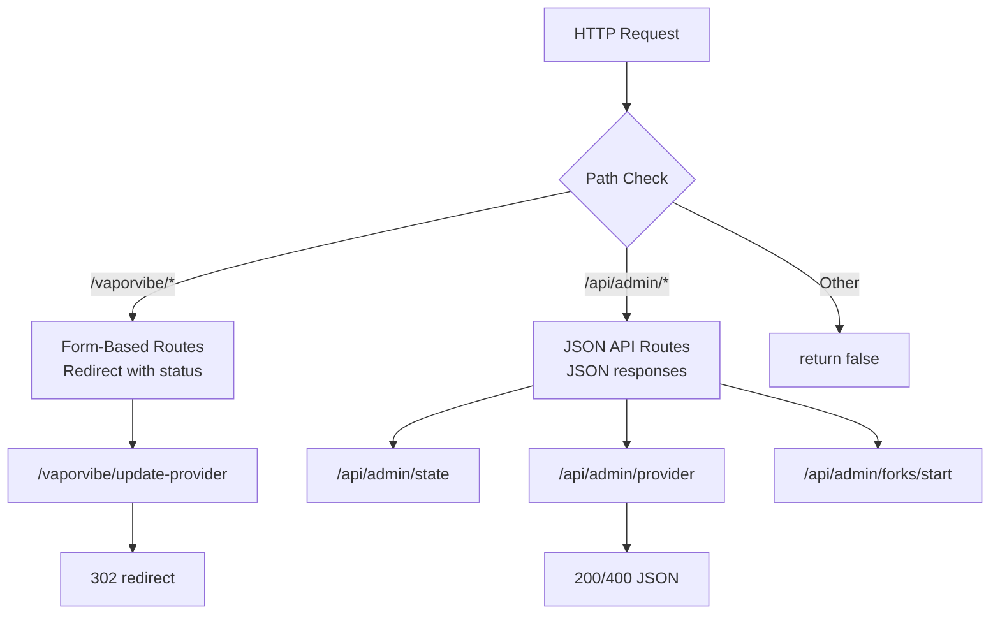
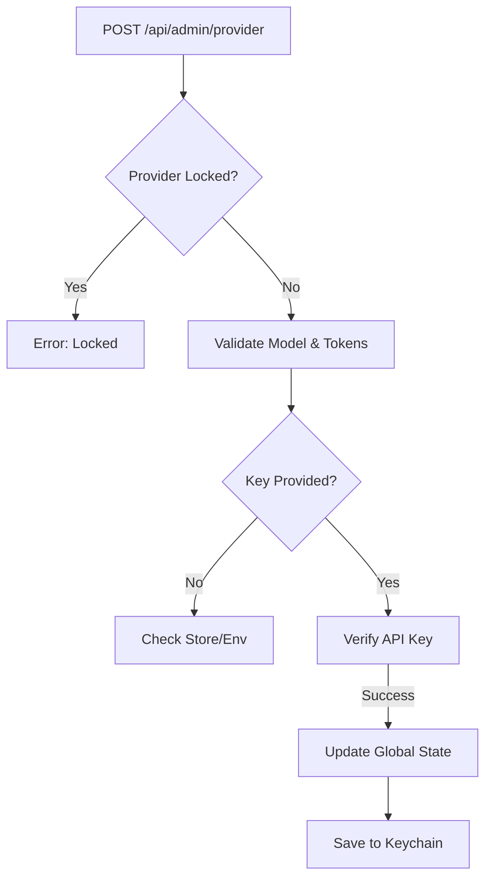

# Architecture: Admin API & Control Plane

> **Scope**: Explains the system's control plane, including configuration management, history operations, and the dual API architecture.

## Purpose
The Admin API allows the frontend (React Dashboard) to control the server. It handles sensitive operations like setting API keys, managing session history, and configuring the runtime behavior.

## Core Concepts

### 1. Dual API Architecture
The system currently supports two API styles:
-   **JSON API (`/api/admin/*`)**: Modern, REST-like. Returns JSON. Used by the React Dashboard.
-   **Form API (`/vaporvibe/*`)**: Legacy, Form-POST. Returns 302 Redirects. Used by the server-rendered Setup Wizard.

### 2. State Management
The `AdminController` is the primary mutator of the global `MutableServerState`.
-   **Configuration**: Updates `state.provider`, `state.brief`, etc.
-   **Credentials**: Persists API keys to the OS Keychain via `CredentialStore`.
-   **Session**: Delegates history operations (clear, delete) to `SessionStore`.

### 3. Route Dispatch Architecture

## Provider Configuration Flow
Updating the LLM provider is a critical operation with multiple steps.

1.  **Validation**: Check if the provider is locked (CLI flag).
2.  **Capabilities**: Verify the model supports the requested features (reasoning, tokens).
3.  **Key Resolution**: Use the provided key, or fall back to the stored key/env var.
4.  **Verification**: Optionally test the key with a real API call.
5.  **Apply**: Update global state and reset the `LlmClient`.

## Key Endpoints
-   `GET /api/admin/state`: The "boot" payload for the dashboard.
-   `POST /api/admin/provider`: Switch models/providers.
-   `POST /api/admin/history/import`: Restore a session snapshot.
-   `POST /api/admin/forks/start`: Initiate A/B testing.

## Key Files
-   **Controller**: `src/server/admin-controller.ts`
-   **State**: `src/types.ts` (`MutableServerState`)
-   **Security**: `src/utils/credential-store.ts`

## Deep Dive: Provider Selection Quirks

The provider selection logic in the Admin Panel is stricter than a typical settings form. This is intentional to prevent the server from entering a broken state.

### 1. Mandatory Verification ("Try before you buy")
You cannot simply "save" an API key. When you click "Save", the server immediately attempts to make a real request to the provider (usually a lightweight `listModels` or `generate` call).
-   **Success**: The key is saved, and the provider becomes active.
-   **Failure**: The update is **rejected** entirely. The old settings remain in effect.
-   **Why?**: This prevents the application from crashing or hanging later when the user attempts a real task. We fail fast at configuration time.

### 2. The "Locked" Provider
If the server is started with a specific provider forced via environment variables (e.g., `VAPORVIBE_PROVIDER=openai`), the provider selection dropdown will be **disabled**.
-   **Behavior**: You can update the API key or model for that provider, but you cannot switch to Anthropic or Gemini.
-   **Reason**: In some deployment environments (like corporate internal tools), we want to enforce a specific LLM compliance policy.

### 3. Key Storage Hierarchy
The system resolves API keys in a specific order of precedence:
1.  **UI Session Override**: A key entered in the Admin Panel (stored in memory or OS keychain).
2.  **Environment Variable**: `OPENAI_API_KEY`, `ANTHROPIC_API_KEY`, etc.
3.  **Missing**: If neither exists, the system enters `providerSelectionRequired` mode.

> **Note**: If you enter a key in the UI, it *masks* the environment variable for the duration of the session.

### 4. Key Masking
The Admin API *never* returns the full API key to the frontend.
-   **Response**: `apiKeyMask: "sk-..."` (first few chars only).
-   **Effect**: The frontend input field will show the mask or be empty. If you want to change the key, you must paste the *entire* new key. You cannot edit a masked key.
