# Download Exports (Offline Prototypes)

> **Feature Overview**: Export your VaporVibe session as self-contained HTML files for offline sharing. Choose between an **animated Clickthrough Tour** with Driver.js walkthrough or a **clean Shareable Prototype** without tour animations.

## Export Types

VaporVibe offers two export formats:

### 📽️ Clickthrough Tour
An **animated walkthrough** that replays the user's exact journey through the application:
- Auto-starts Driver.js tour on page load
- Shows typing animations for form inputs
- Simulates button clicks and view transitions
- Includes popover descriptions for each step
- **Best for**: Stakeholder demos, training materials, feature documentation

### 📄 Shareable Prototype  
A **clean, static prototype** with all features intact but no tour animations:
- Full application functionality preserved
- No auto-start tour or animations
- User has complete control over navigation
- Smaller file size (no Driver.js overhead)
- **Best for**: Designer handoffs, usability testing, clean code samples

## Common Features

Both export types share these characteristics:
- **Fully offline** — Runs entirely in the browser without a server
- **Self-contained** — All AI-generated images embedded as base64
- **CDN libraries** — Uses public CDNs for Tailwind, Alpine.js, etc.
- **Cross-platform** — Works in any modern browser

---

## Table of Contents

- [Export Types](#export-types)
- [Usage](#usage)
  - [Clickthrough Tour](#clickthrough-tour)
  - [Shareable Prototype](#shareable-prototype-1)
- [How It Works](#how-it-works)
- [API Reference](#api-reference)
- [LLM Prompt Architecture](#llm-prompt-architecture)
- [Generated Output Structure](#generated-output-structure)
- [Driver.js Integration](#driverjs-integration)
- [Image Handling](#image-handling)
- [CDN Transformation](#cdn-transformation)
- [Key Design Decisions](#key-design-decisions)
- [Quirks & Pitfalls](#quirks--pitfalls)
- [Troubleshooting](#troubleshooting)
- [Future Improvements](#future-improvements)

---

## Usage

### Clickthrough Tour

1. Navigate to the **History** tab in the Admin Console (`/vaporvibe`)
2. Locate the **Export & Share** section
3. Click the **Clickthrough Tour** card (▶️ icon)
4. Wait 1-2 minutes while the LLM generates the consolidated SPA
5. The browser will download `prototype-tour.html`
6. Open the file in any browser — the tour auto-starts!

### Shareable Prototype

1. Navigate to the **History** tab in the Admin Console (`/vaporvibe`)
2. Locate the **Export & Share** section
3. Click the **Shareable Prototype** card (📄 icon)
4. Wait 1-2 minutes while the LLM generates the consolidated SPA
5. The browser will download `prototype.html`
6. Open the file in any browser — explore freely without tour guidance!

### Requirements

- At least one history entry in the session
- A configured LLM provider with valid API key
- Image generation enabled (optional, for AI images)

### Limitations While Active

- The download button is **disabled** while an A/B comparison fork is active
- The button shows a loading state during generation (can take 1-2 minutes)

---

## How It Works

```mermaid
graph LR
    subgraph "Admin Console"
        A[Session History] -->|"Click Download Tour"| B[POST /api/project/:id/generate-tour]
    end
    
    subgraph "Backend Processing"
        B --> C[Build Tour Mode Prompt]
        C --> D[Send to LLM Provider]
        D --> E[Receive HTML Response]
        E --> F[Resolve Component Placeholders]
        F --> G[Extract & Generate Missing Images]
        G --> H[Transform /libs/ to CDN URLs]
        H --> I[Embed Images as Base64]
    end
    
    subgraph "Output"
        I --> J[Self-Contained HTML File]
        J --> K[Download to Browser]
    end
```



### Processing Steps

1. **Prompt Assembly**: The backend builds a special `tourMode=true` prompt that includes all session history
2. **LLM Generation**: The model consolidates all views into a single-page application with Driver.js tour
3. **Placeholder Resolution**: Any `{{component:...}}` placeholders are resolved from the component cache
4. **Image Generation**: Missing AI images are generated and cached
5. **CDN Transformation**: Local `/libs/*` paths are converted to jsDelivr/unpkg CDN URLs
6. **Base64 Embedding**: All images are embedded inline as base64 data URIs
7. **File Download**: The complete HTML is sent as an attachment

---

## API Reference

### Generate Tour

```
POST /api/project/:projectId/generate-tour
```

**Request Body:**
```json
{
  "sessionId": "abc123-session-id"
}
```

**Response (Success):**
- Content-Type: `text/html`
- Content-Disposition: `attachment; filename="prototype-tour.html"`
- Body: Complete HTML document

**Response (Error):**
```json
{
  "success": false,
  "message": "sessionId is required to generate a tour"
}
```

**Response Codes:**
- `200` — Success, HTML file returned
- `400` — Missing sessionId or invalid request
- `500` — LLM generation or processing error

---

## LLM Prompt Architecture

The tour mode prompt lives in `src/llm/messages.ts` and is activated when `tourMode: true` is passed to `buildMessages()`.

### Key Differences from Normal Mode

| Aspect         | Normal Mode        | Tour Mode                  |
| -------------- | ------------------ | -------------------------- |
| **Output**     | Single view HTML   | Multi-view SPA             |
| **Navigation** | Server round-trips | Client-side `switchView()` |
| **Forms**      | Submit to server   | JavaScript handlers        |
| **API calls**  | Real `fetch()`     | Mocked with local state    |
| **Libraries**  | Optional           | Driver.js required         |

### Prompt Structure

The tour mode system prompt instructs the LLM to:

1. **Audit the entire history** — Analyze all requests, form submissions, page transitions
2. **Consolidate into SPA** — Merge all views into `<div class="app-view">` containers
3. **Implement `switchView()`** — Client-side navigation function
4. **Generate Driver.js tour** — Steps array that replays the user's journey
5. **Preserve exact data** — Form inputs, search queries, created content from history
6. **Mock all APIs** — No `fetch()` calls, update local state instead

### Image Manifest

When images are present, the prompt includes an image manifest:

```
### Available Images (Manifest)
- ID: "abc123" | Ratio: 16:9 | Prompt: "A futuristic cityscape..."
- ID: "def456" | Ratio: 1:1 | Prompt: "A friendly robot mascot..."
```

The LLM is instructed to reference images by `data-image-id` attribute.

---

## Generated Output Structure

### HTML Structure

```html
<!DOCTYPE html>
<html lang="en">
<head>
    <meta charset="UTF-8">
    <title>Prototype Tour</title>
    <!-- CDN links for libraries -->
    <link rel="stylesheet" href="https://cdn.jsdelivr.net/npm/daisyui@4.12.24/dist/full.css">
    <script src="https://cdn.tailwindcss.com/3.4.1"></script>
    <link rel="stylesheet" href="https://cdn.jsdelivr.net/npm/driver.js@1.4.0/dist/driver.css">
    <script src="https://cdn.jsdelivr.net/npm/driver.js@1.4.0/dist/driver.js.iife.js"></script>
</head>
<body>
    <!-- Shared Shell (always visible) -->
    <header id="app-header">...</header>
    <nav id="app-sidebar">...</nav>
    
    <!-- View Containers -->
    <div id="view-dashboard" class="app-view">...</div>
    <div id="view-editor" class="app-view" style="display: none">...</div>
    <div id="view-settings" class="app-view" style="display: none">...</div>
    
    <!-- Embedded Images -->
    
    
    <script>
        // View switching
        function switchView(viewId) {
            document.querySelectorAll('.app-view').forEach(v => v.style.display = 'none');
            document.getElementById('view-' + viewId).style.display = 'block';
        }
        
        // Driver.js tour initialization
        const driverObj = window.driver.js.driver({
            showProgress: true,
            allowClose: false,
            steps: [...]
        });
        
        // Auto-start on load
        driverObj.drive();
    </script>
</body>
</html>
```

---

## Driver.js Integration

### Version & Initialization

VaporVibe uses **Driver.js v1.4.0**. The v1.x API differs significantly from v0.x:

```javascript
// ✅ CORRECT v1.x initialization
const driverObj = window.driver.js.driver({
    showProgress: true,
    allowClose: false,
    steps: [...]
});
driverObj.drive();

// ❌ WRONG — v0.x syntax, will not work
const driver = new Driver();
driver.defineSteps([...]);
driver.start();
```

### Variable Naming (Critical!)

**NEVER** name your variable `driver` — this shadows the global `window.driver` and causes:
```
Uncaught ReferenceError: Cannot access 'driver' before initialization
```

Always use `driverObj` or another name.

### Tour Step Structure

```javascript
{
    element: '#submit-button',  // CSS selector
    popover: {
        title: 'Submit Your Order',
        description: 'Click here to complete your purchase.'
    },
    onHighlightStarted: () => {
        // Called before highlighting — switch views here
        switchView('checkout');
    },
    onHighlighted: (element) => {
        // Called after highlighting — simulate interactions here
        if (element) {
            setTimeout(() => element.click(), 800);
        }
    },
    onDeselected: (element) => {
        // Called when moving to next step
    }
}
```

### Simulated Interactions

#### Typing Animation
```javascript
onHighlighted: (element) => {
    if (!element) return;
    const text = 'Hello, World!';
    let i = 0;
    const interval = setInterval(() => {
        element.value = text.slice(0, ++i);
        element.dispatchEvent(new Event('input', { bubbles: true }));
        if (i >= text.length) clearInterval(interval);
    }, 50);
}
```

#### Button Clicks
```javascript
onHighlighted: (element) => {
    if (element) {
        setTimeout(() => element.click(), 800);
    }
}
```

**Important**: The tour does NOT auto-advance. Users click "Next" manually.

---

## Image Handling

### Overview

The tour export pipeline includes sophisticated image handling to ensure offline capability while minimizing file size:

1. **Extract Requests**: Parse `<ai-image>` tags from generated HTML
2. **Check Cache**: Look for existing images by `modelId:ratio:prompt` key
3. **Generate Missing**: Call image generation API for uncached images
4. **Filter Referenced**: Only include images actually used in the final HTML
5. **Reencode for Size**: Compress images using Sharp (JPEG for non-alpha, PNG for transparency)
6. **Embed Base64**: Convert to data URIs for offline access

### Image Recompression (Sharp)

To reduce exported file size, images are recompressed before embedding:

**Location**: `src/utils/image-reencoder.ts`

| Image Type    | Strategy              | Target                  |
| ------------- | --------------------- | ----------------------- |
| **No alpha**  | Convert to JPEG       | < 200KB per image       |
| **Has alpha** | Keep as PNG, compress | Best-effort compression |

#### Compression Algorithm

```typescript
// For non-alpha images:
// 1. Start at quality 85
// 2. If > 200KB, estimate required quality from ratio
// 3. Retry up to 2x with progressively lower quality
// 4. Minimum quality: 40 (to maintain visual acceptable)

const { buffer, quality } = await encodeToJpeg(originalBuffer, MAX_JPEG_SIZE);
```

#### Alpha Detection

The reencoder uses Sharp to detect if transparency is actually **used**:

```typescript
// Check if alpha channel has values < 255 (actual transparency)
const stats = await sharp(buffer).stats();
if (stats.channels[3].min < 255) {
    // Has real transparency - keep as PNG
}
```

This prevents converting images with unused alpha channels to bloated PNGs.

#### Logging

The reencoder logs compression results:

```
Re-encoded 5 images, saved 847KB (62%)
```

### Image Tag Attributes

```html
<!-- Input (from LLM) -->
<ai-image 
    data-image-id="abc123"
    prompt="A futuristic cityscape at sunset"
    ratio="16:9"
    width="100%">
</ai-image>

<!-- Output (after processing) -->

```

### Manifest Matching

The LLM receives a manifest of available images and should reference them by ID:
- ✅ `data-image-id="abc123"` — Uses existing image
- ❌ New prompts — Will generate new images (slow, costly)

---

## CDN Transformation

Local `/libs/*` paths are transformed to CDN URLs for offline portability.

### Transformation Logic

Located in `src/utils/html-export-transform.ts`:

```typescript
// Input
<script src="/libs/alpinejs/3.14.9/alpine.js"></script>

// Output
<script src="https://cdn.jsdelivr.net/npm/alpinejs@3.14.9/dist/cdn.min.js"></script>
```

### CDN Providers

| Library Type     | CDN Provider                  |
| ---------------- | ----------------------------- |
| Most libraries   | jsDelivr (`cdn.jsdelivr.net`) |
| Tailwind CSS     | tailwindcss.com CDN           |
| Fontsource fonts | jsDelivr (`@fontsource/*`)    |

### Verification Scripts

Two scripts validate CDN mappings:

```bash
# Check all CDN URLs are reachable
npx tsx scripts/verify-cdn-urls.ts

# Compare local files with CDN content
npx tsx scripts/verify-cdn-content.ts
```

---

## Key Design Decisions

| Decision                        | Rationale                                            |
| ------------------------------- | ---------------------------------------------------- |
| **No `driverObj.moveNext()`**   | User controls pace; prevents accidental skipping     |
| **No Rough Notation library**   | Annotations are difficult to clean up between steps  |
| **Simple `setInterval` typing** | More reliable than Typewriter.js across frameworks   |
| **No framework internals**      | Avoid `__x.$data` etc. — use plain JS or public APIs |
| **Base64 image embedding**      | Ensures true offline capability                      |
| **CDN transformation**          | Removes dependency on VaporVibe server               |
| **onDeselected for actions**    | Execute actions after user clicks "Next"             |

---

## Quirks & Pitfalls

### Element Selectors

**Use ONLY static HTML attributes** for tour step selectors:

| ✅ Valid Selectors      | ❌ Invalid Selectors     |
| ---------------------- | ----------------------- |
| `#my-button`           | `[x-text='title']`      |
| `.submit-btn`          | `[@click='submit()']`   |
| `[data-tour-step="1"]` | `[x-model='form.name']` |

Framework directives are not valid CSS selectors!

### Defensive Callbacks

**ALWAYS null-check** parameters:

```javascript
onHighlighted: (element) => {
    if (!element) return;  // Element might not exist
    const card = element.closest('.card');
    if (!card) return;  // Parent might not exist
    const btn = card.querySelector('button');
    if (btn) setTimeout(() => btn.click(), 800);
}
```

### Offline Execution

The exported tour runs from `file://` protocol:

- ❌ `fetch('/rest_api/...')` — CORS errors
- ❌ `XMLHttpRequest` — Network errors
- ✅ Local state updates with `setTimeout` feedback

### Alpine.js State Sync

When updating form values, dispatch events to sync Alpine.js:

```javascript
element.value = 'new value';
element.dispatchEvent(new Event('input', { bubbles: true }));
```

---

## Troubleshooting

### "Cannot access 'driver' before initialization"

**Cause**: Variable named `driver` shadows global.  
**Fix**: Rename to `driverObj`.

### Tour doesn't start automatically

**Cause**: Missing `driverObj.drive()` call.  
**Fix**: Ensure the LLM prompt includes auto-start instruction.

### Images missing in exported file

**Cause**: New prompts not in manifest, or image generation failed.  
**Fix**: Check server logs for generation errors.

### Styles broken in offline file

**Cause**: CDN URL transformation failed for some library.  
**Fix**: Run `npx tsx scripts/verify-cdn-urls.ts` to identify broken mappings.

### Forms don't work

**Cause**: Form still submitting to server instead of JS handler.  
**Fix**: Ensure LLM converts forms to `onsubmit="handleSubmit(event)"`.

### Tour steps highlight wrong elements

**Cause**: Using framework directives as selectors.  
**Fix**: Add explicit `id` or `data-tour-step` attributes.

---

## File Locations

| Purpose              | File                                    |
| -------------------- | --------------------------------------- |
| Tour mode prompt     | `src/llm/messages.ts` (lines 77-250)    |
| API endpoint handler | `src/server/admin-controller.ts`        |
| CDN transformation   | `src/utils/html-export-transform.ts`    |
| Image extraction     | `src/utils/extract-ai-images.ts`        |
| Image recompression  | `src/utils/image-reencoder.ts`          |
| CDN verification     | `scripts/verify-cdn-urls.ts`            |
| Content verification | `scripts/verify-cdn-content.ts`         |
| Frontend handler     | `frontend/src/pages/AdminDashboard.tsx` |
| Frontend API         | `frontend/src/api/admin.ts`             |

---

## Future Improvements

- [ ] **Video export** — WebM/MP4 recording for truly offline sharing
- [ ] **Customizable tour speed** — User-controlled animation timing
- [ ] **Tour narration** — Text-to-speech for accessibility
- [ ] **Step editor** — UI to customize tour steps post-generation
- [ ] **Template library** — Pre-built tour templates for common flows
- [ ] **Analytics** — Track tour completion rates when shared
