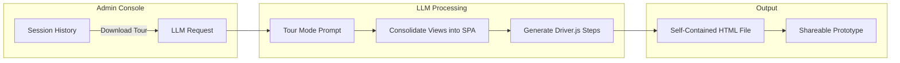

# Download Tour (Clickthrough Prototypes)

> **Feature Overview**: Export your VaporVibe session as a self-contained HTML file with an embedded Driver.js walkthrough that replays the user's exact journey.

## Purpose

The Download Tour feature addresses a key use case: **sharing prototypes with stakeholders who don't have access to the VaporVibe server**. Instead of explaining the UX flow in a meeting or recording a video, you can hand off a single HTML file that:

- Plays through the exact click path the user took
- Shows typing animations for form inputs
- Simulates button clicks and view transitions
- Runs entirely offline in any browser

## How It Works



### 1. Tour Mode Prompt

When the user clicks "Download Tour" in the admin console, the backend sends a request to the LLM with a special `tourMode=true` flag. This activates a different system prompt in `src/llm/messages.ts` (lines 77-145) that instructs the LLM to:

1. **Audit the history** — Analyze all requests, form submissions, and page transitions
2. **Consolidate into SPA** — Merge all distinct views into a single-page application
3. **Generate Driver.js tour** — Create a `steps` array that replays the user's journey

### 2. Single-Page Application Structure

The LLM generates a single `index.html` file with this structure:

```html
<body>
    <!-- Shared Shell (always visible) -->
    <header id="app-header">...</header>
    <nav id="app-sidebar">...</nav>
    
    <!-- View Containers (toggled by switchView) -->
    <div id="view-dashboard" class="app-view">...</div>
    <div id="view-editor" class="app-view" style="display: none">...</div>
    <div id="view-settings" class="app-view" style="display: none">...</div>
    
    <script>
        function switchView(viewId) {
            document.querySelectorAll('.app-view').forEach(v => v.style.display = 'none');
            document.getElementById('view-' + viewId).style.display = 'block';
        }
    </script>
</body>
```

### 3. Driver.js Tour Configuration

**IMPORTANT — v1.x API**: The IIFE bundle exposes `window.driver`.  
**NEVER** name your variable `driver` — this shadows the global and causes `"Cannot access 'driver' before initialization"` errors!

```javascript
// CORRECT v1.x initialization (use 'driverObj', NOT 'driver'):
const driverObj = window.driver.js.driver({
    showProgress: true,
    allowClose: false,  // User can't escape the tour
    steps: [
        {
            element: '#some-element',
            popover: { title: 'Step Title', description: 'What's happening here' },
            onHighlightStarted: () => switchView('dashboard'),  // Ensure view is visible
            onHighlighted: (element) => {
                // Simulate typing or clicking
            }
        },
        // ... more steps
    ]
});

// Auto-start immediately
driverObj.drive();
```

### 4. Simulated Interactions

#### Typing Animations
For form inputs, the LLM generates a simple `setInterval` typing effect:

```javascript
onHighlighted: (element) => {
    const text = 'User entered text';
    let i = 0;
    const interval = setInterval(() => {
        element.value = text.slice(0, ++i);
        element.dispatchEvent(new Event('input', { bubbles: true }));
        if (i >= text.length) clearInterval(interval);
    }, 50);
}
```

#### Button Clicks
For buttons, a delayed click simulation:

```javascript
onHighlighted: (element) => {
    setTimeout(() => element.click(), 800);
}
```

**Important**: The tour does NOT auto-advance after interactions. The user must click "Next" in the popover to continue.

## Visual Styling

The active tour element receives special styling:

```css
.driver-active-element {
    box-shadow: 0 0 0 4px #570df8 !important;
    z-index: 100000 !important;
}
```

## Key Design Decisions

| Decision                            | Rationale                                                 |
| :---------------------------------- | :-------------------------------------------------------- |
| **No `driverObj.moveNext()` calls** | User controls pace; prevents accidental skipping          |
| **No Rough Notation library**       | Annotations are difficult to clean up between steps       |
| **Simple `setInterval` typing**     | More reliable than Typewriter.js across frameworks        |
| **No framework internals**          | Avoid `__x.$data` etc. — use plain JS or public APIs      |
| **Preserve exact user data**        | Form inputs, search queries, created content from history |
| **Copy exact CSS classes**          | Visual fidelity with original generated pages             |

## Libraries Used

The tour output uses the standard library assets available to all VaporVibe generation:

- **Driver.js** (`driver.js@1.4.0`) — Step-by-step tour overlay
- **DaisyUI + Tailwind CSS** — Styling (if used in original)
- **Alpine.js / Other frameworks** — If used in original pages
- **Any other `/libs/*` assets** — Preserved from session

## Limitations & Pitfalls

### Element Selectors ⚠️

**Use ONLY static HTML attributes** for tour step selectors:
- ✅ `id`, `data-*` attributes, class names
- ❌ **NEVER** use framework directives like `[x-text='...']`, `[@click='...']`, `[x-model='...']`

Framework directives are not valid CSS selectors! Always add unique `id` attributes to elements you need to target.

### Defensive Callbacks

**ALWAYS null-check** parameters in `onHighlighted`:

```javascript
onHighlighted: (element) => {
    if (!element) return; // Element not found
    const card = element.closest('.note-card');
    if (!card) return; // Parent not found
    const btn = card.querySelector('button');
    if (btn) setTimeout(() => btn.click(), 800);
}
```

### Offline Execution

The exported tour runs from `file://` protocol — **all network requests will fail**!

- ❌ No `fetch('/rest_api/...')` calls — they cause CORS errors
- ✅ Mock ALL APIs with local state updates and `setTimeout` for feedback

### Other Limitations

1. **AI Images** — `<ai-image>` tags need the server to resolve; exported tours may have missing images unless converted to inline base64
2. **Complex State** — Multi-step wizards with complex state machines may not replay perfectly
3. **Framework State Sync** — Alpine.js `x-model` bindings may need manual `dispatchEvent('input')` triggers

## File Location

The tour mode prompt lives in:
- **`src/llm/messages.ts`** — Lines 77-145 (the `tourMode` conditional branch)

## Future Improvements

- Inline base64 conversion for AI-generated images
- Video export (WebM/MP4) for truly offline sharing
- Customizable tour speed controls
- Tour narration via text-to-speech
