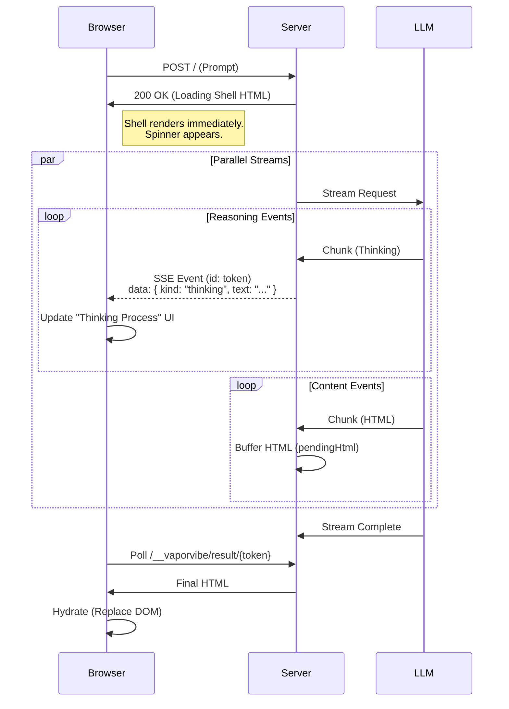
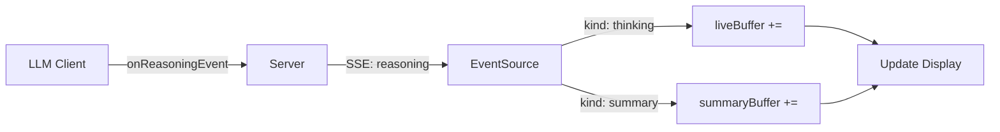
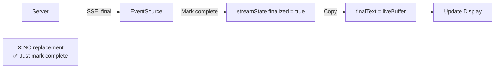

# Architecture: LLM Data Pipeline & Formats

> **Scope**: Explains how data flows from the LLM provider through the server to the user's screen, including data formats, streaming, and reasoning.

## 1. Data Formats

### Provider Formats (External)
Each provider (OpenAI, Anthropic, Google, etc.) has its own API schema.
-   **OpenAI**: `chat.completions` with `messages` array. Streaming uses SSE.
-   **Anthropic**: `messages.create` with `system` separate from `messages`.
-   **Gemini**: `generateContent` with `parts` array.

### Internal Normalized Formats
To keep the system modular, we normalize everything into standard interfaces defined in `src/llm/client.ts` and `src/types.ts`.

#### `ChatMessage` (Input)
The universal input format for our `LlmClient`.
```typescript
interface ChatMessage {
  role: "system" | "user" | "assistant";
  content: string;
  // ... attachments (images)
}
```

#### `LlmResult` (Output)
The universal output format.
```typescript
interface LlmResult {
  html: string;           // The final generated content
  usage?: LlmUsageMetrics; // Token counts
  reasoning?: LlmReasoningTrace; // Captured thinking process
  raw?: unknown;          // Original provider response (for debugging)
}
```

#### `HistoryEntry` (Persistence)
How we store interactions in `SessionStore`.
```typescript
interface HistoryEntry {
  id: string;
  role: "user" | "assistant";
  content: string; // HTML or Text
  reasoning?: LlmReasoningTrace;
  // ... metadata (timestamp, usage)
}
```

## 2. The Pipeline Flow

### Step 1: Context Construction (`server.ts`)
When a user sends a prompt:
1.  **History Retrieval**: `SessionStore.getHistoryForPrompt(sid)` fetches previous turns.
2.  **Prompt Building**: `buildMessages()` converts `HistoryEntry[]` -> `ChatMessage[]`.
    -   It injects the `System Prompt` (with current time, rules).
    -   It attaches `BriefAttachments` (files).
    -   It formats `RestMutationRecord`s as context.

### Step 2: Generation & Streaming (`LlmClient`)
The `LlmClient` (e.g., `OpenAiClient`) sends the request.
-   **Streaming**: We pass an `LlmStreamObserver` to `generateHtml()`.
-   **Normalization**: As chunks arrive from the provider, the client converts them into `LlmReasoningStreamEvent`s.

```typescript
interface LlmReasoningStreamEvent {
  kind: "thinking" | "summary"; // "thinking" = reasoning, "summary" = final HTML
  text: string;
}
```

### Step 3: Server-Side Streaming (Side-Channel Architecture)
The server maintains *two* simultaneous streams for a single user request to decouple generation speed from rendering speed.



1.  **The HTTP Response (Loading Shell)**:
    -   The server immediately responds with the `Loading Shell` HTML (200 OK).
    -   This page contains a client-side script (`reasoning-stream.js`) that connects to the SSE endpoint.
    -   It also contains `hydrate.js` which polls for the final result.

2.  **The SSE Stream (Reasoning)**:
    -   **Endpoint**: `/__vaporvibe/reasoning/{token}`
    -   **Mechanism**: Server-Sent Events (SSE).
    -   **Flow**: `LlmClient` -> `LlmStreamObserver` -> `EventEmitter` -> `res.write("event: reasoning\ndata: ...")`.
    -   **Buffering**: The server buffers the first ~200 events to ensure the frontend doesn't miss anything if it connects slightly after the stream starts.

### Step 4: Completion & Storage
Once the stream finishes:
1.  The `LlmClient` returns the full `LlmResult`.
2.  The server creates a new `HistoryEntry`.
3.  **Component Cache**: The server scans the output for reusable components (`prepareReusableCaches`).
4.  **Persistence**: `SessionStore.appendHistoryEntry()` saves the turn.

### Step 5: Final Render (Hydration)
1.  The `LlmClient` finishes.
2.  The `/__vaporvibe/result/{token}` endpoint (which the client is polling) returns the final HTML.
3.  The client-side `hydrate.js` script replaces the entire DOM with this new content.

## 3. Reasoning System
"Reasoning" (Chain of Thought) is treated as a first-class citizen.

### Extraction
Different providers handle reasoning differently:
-   **Explicit Field**: Some APIs (DeepSeek) return a separate `reasoning_content` field.
-   **Tags**: Others (standard models) might use `<thinking>` tags. We parse these out.
-   **Gemini**: Returns `part.thought` in chunks. We aggregate these into `thinking` events.

### Display Logic (Frontend)
The frontend (`interceptor.ts` and `reasoning-stream.js`) uses a simplified display logic to ensure consistency and prevent flickering.

#### Core Principle: "What you see is what you get"
-   **During Streaming**: The UI accumulates `thinking` events into a `liveBuffer`.
-   **On Completion**: The `final` event simply marks the stream as complete. It does **not** replace the content with a separate "final" payload from the backend.
-   **Result**: The user sees exactly what was streamed, with no jarring content swaps or header changes at the end.

#### Unified Presentation
-   **No Artificial Headings**: We removed injected headings like "Summary" or "Thinking Process". The UI displays the raw stream content. If the LLM wants structure, it generates markdown headings itself.
-   **Single Source of Truth**: The streaming buffer is the source of truth for the UI. The `final` event's payload is used only for backend history persistence.

### Reasoning Stream Architecture (Simplified)



**Finalization Phase**:


## 4. Debugging & Troubleshooting

### Fast Debugging Checklist
1.  **Enable Debug Logs**: Set `LOG_LEVEL=debug` (or `logger.level = "debug"` in scripts).
2.  **Check Event Types**: Look for `[StreamEvent] kind=thinking`. If you see `kind=summary` during streaming, it might cause double-rendering.
3.  **Verify Final Trace**: Ensure `result.reasoning.details` is populated. If it's empty, the history view won't show the thought process.

### Common Issues & Fixes

#### Issue: Reasoning "Flashes" or Disappears
-   **Symptom**: The "Thinking..." section expands, shows text, then suddenly clears and restarts or changes header.
-   **Cause**: The frontend logic is switching headers (e.g., "Thinking aloud" -> "Final reasoning") or the backend is emitting a "reset" event (like a redundant `summary` event at the end).
-   **Fix**:
    1.  Ensure `LlmClient` only emits `thinking` events for streaming thoughts.
    2.  Ensure frontend uses a consistent header string (e.g., "Thinking process") for all states.

#### Issue: Gemini Reasoning is Empty
-   **Symptom**: No reasoning appears in the UI, but the model is working.
-   **Cause**: Gemini 2.x models require `thinkingBudget` (via `reasoningTokens`). If this is 0 or undefined, reasoning is disabled.
-   **Fix**: Check `reasoningTokensEnabled: true` and `reasoningTokens > 0` in the request config.

#### Issue: Double Headers in History
-   **Symptom**: The history view shows "Thinking Process" followed by "Thinking Process" again.
-   **Cause**: The `raw` reasoning trace contains the header text itself (e.g., `**Thinking Process**\n\n...`).
-   **Fix**: The `LlmClient` should clean the raw trace before returning it, or the frontend should strip known headers.

### Reproduction Scripts
Use standalone scripts (like `reproduce-gemini-issue.ts`) to isolate the `LlmClient` from the full server stack. This allows you to inspect the raw event stream without browser interference.

## Deep Dive: The Loading Shell

### The "Transition" Problem
LLMs are slow. Generating a full HTML page can take 10-30 seconds. Leaving the user staring at a white screen or a spinning favicon is bad UX.

### The Solution: Streaming HTML
We use Node.js's `res.write()` to send data in three distinct phases within a *single* HTTP response:

1.  **Phase 1: The Shell (Immediate)**
    -   Server sends `<!DOCTYPE html><html>...<div id="loading-shell">...</div>`.
    -   This renders immediately. It contains a CSS spinner and a "Thinking..." accordion.
    -   It also contains a small inline script (`hydration-script`) that listens for upcoming data chunks.

2.  **Phase 2: The Stream (Reasoning)**
    -   As the LLM "thinks", the server flushes `<script>updateReasoning("...")</script>` tags.
    -   The browser executes these scripts immediately, appending text to the "Thinking..." accordion.
    -   This gives the user instant feedback that work is happening.

3.  **Phase 3: The Swap (Completion)**
    -   When the LLM finishes the HTML, the server sends the final payload wrapped in a `<template>` tag.
    -   A final script runs: `replaceShellWithContent()`.
    -   This nukes the `#loading-shell` and injects the generated HTML into the DOM.
    -   To the user, it looks like the page "snapped" into place after thinking.
