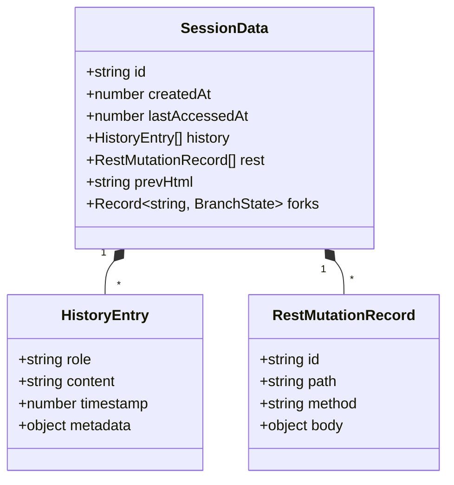
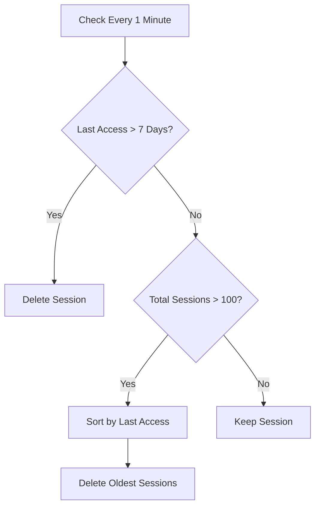

# Architecture: Session Lifecycle & Storage

> **Scope**: Explains how user sessions are created, stored, managed, and expired.

## Purpose
VaporVibe is a stateful application. Unlike a typical REST API where requests are independent, here every request builds upon the previous context. The `SessionStore` manages this state.

## Core Concepts

### 1. Session Identity
-   **Cookie**: `sid` (HTTP-only, Secure, Lax).
-   **ID Format**: 32-character hex string (crypto-random).
-   **Creation**: Lazy. A session is created only when a user visits the app or the admin panel.

### 2. In-Memory Storage
All state is stored in memory (`Map<string, SessionData>`).
-   **Pros**: Fast, simple, no external DB dependency.
-   **Cons**: Data is lost on server restart.
-   **Mitigation**: Users can "Export" their history to JSON and "Import" it later.

### 3. Data Model

### 4. Eviction Strategy
To prevent memory leaks, the store implements two cleanup mechanisms:

-   **TTL (Time-To-Live)**: Sessions inactive for > 7 days (configurable) are marked expired.
-   **LRU (Least Recently Used)**: If the number of sessions exceeds `capacity` (default 100), the oldest sessions are deleted, even if not expired.

## Key Files
-   **Store**: `src/server/session-store.ts`
-   **Types**: `src/types.ts` (`SessionData`, `HistoryEntry`)
