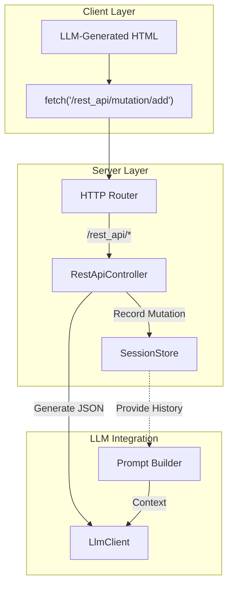

# Architecture: Virtual REST API

> **Scope**: Explains the fake backend system that allows LLM-generated apps to perform CRUD operations without a database.

## Purpose
To reduce token costs and latency, we avoid regenerating the full HTML page for every small data change. Instead, the LLM generates HTML that makes `fetch()` calls to a "Virtual REST API". The server handles these calls by generating JSON responses and recording the state change.

## Core Concepts

### 1. The Illusion of Persistence
There is no database. "Persistence" is achieved by feeding the history of mutations back into the LLM's context window.
-   **Write**: Client POSTs to a mutation endpoint. Server records it.
-   **Read**: Client GETs a query endpoint. Server asks LLM to generate JSON based on the recorded mutations.
-   **Render**: Next time the LLM generates HTML, it sees "User added item X" in the history and renders it in the list.

### 2. Dynamic Namespaces
The API does not have fixed endpoints. Instead, it uses two **namespaces** that the LLM can invent paths within:

-   **`/rest_api/query/*`**: Read-only operations.
    -   *Examples*: `/rest_api/query/users`, `/rest_api/query/tasks/123`, `/rest_api/query/search?q=foo`
    -   *Behavior*: Returns JSON generated by the LLM. Side-effect free.
-   **`/rest_api/mutation/*`**: Write operations.
    -   *Examples*: `/rest_api/mutation/create-task`, `/rest_api/mutation/update-profile`
    -   *Behavior*: Returns JSON `{ success: true }` (usually). Records a `RestMutationRecord` in the session.

-   **`/rest_api/image/generate`**: Image generation endpoint (special case).
    -   *Behavior*: Generates images via OpenAI or Google, bypasses LLM entirely.
    -   *See*: [Image Generation Module](../modules/image-gen.md)

### 3. Token Optimization
-   **Full Page Reload**: ~10,000 tokens (Input) + ~2,000 tokens (Output). Slow.
-   **Virtual REST Call**: ~5,000 tokens (Input) + ~100 tokens (Output). Fast.

## Architecture & Request Flow



### Request Lifecycle
1.  **Client**: `fetch('/rest_api/mutation/create-task', { body: ... })`
2.  **Server (`RestApiController`)**:
    -   Validates request (headers, session).
    -   **Mutation**: Records the operation in `SessionStore`.
    -   **Query**: Asks LLM to generate data based on history.
3.  **Client**: Updates DOM (optimistically or via re-fetch).
4.  **Next Turn**: User asks "What tasks do I have?".
5.  **Server**: Builds prompt including "Recent Mutations: create-task...".
6.  **LLM**: "You have one task..."

## Deep Dive: Data & Errors

### Mutation Recording
When a mutation occurs, we don't just "do" it; we **log** it. This log is the source of truth for the LLM's memory.

**Example Record:**
```json
{
  "id": "550e8400-e29b-41d4-a716-446655440000",
  "path": "/rest_api/mutation/add-todo",
  "method": "POST",
  "body": { "text": "Buy milk" },
  "createdAt": "2023-10-25T10:00:00.000Z"
}
```
This object is stringified and injected into the system prompt under "Recent REST Mutations".

### Query Response Generation
When the client requests data, the LLM synthesizes it from the brief and mutation history.

**Example Request:** `GET /rest_api/query/todos`
**Context Provided:**
-   *Brief*: "Todo list app"
-   *Mutations*: `add-todo { text: "Buy milk" }`
**Generated JSON:**
```json
{
  "todos": [
    { "id": 1, "text": "Buy milk", "completed": false }
  ]
}
```

### Error Handling
Since we rely on an LLM to generate JSON, things can go wrong.
-   **Malformed JSON**: If the LLM outputs `{'id': 1}` (invalid quotes) or adds Markdown text outside the JSON block, the server catches the `JSON.parse` error.
-   **Fallback**: The server responds with `502 Bad Gateway` and `{ "success": false, "error": "Invalid JSON from model" }`.
-   **Correction**: The error is recorded in history. In the next turn, the LLM might see its mistake and correct it (though we don't currently implement an automatic retry loop).

## Key Files
-   **Controller**: `src/server/rest-api-controller.ts`
-   **Storage**: `src/server/session-store.ts` (See `rest` field in `SessionData`)
-   **Image Generation**: `src/image-gen/` (See [Image Generation Module](../modules/image-gen.md))

