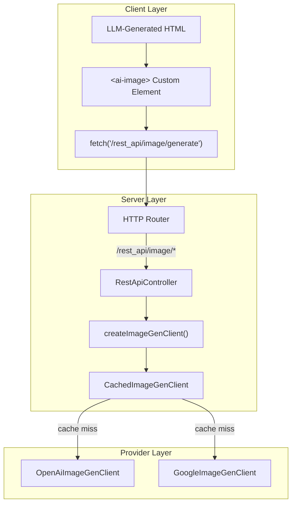

# Module Documentation: Image Generation (`src/image-gen/`)

> **Directory**: `src/image-gen/`  
> **Purpose**: On-demand image generation for LLM-generated applications

> [!WARNING]
> This documentation is manually maintained and may be outdated. Always verify against the source code.

## Overview

The Image Generation module provides a modular, provider-agnostic system for generating images on demand. LLM-generated applications can request images via the Virtual REST API, and the server will generate them using the configured provider (OpenAI or Google) and cache the results in memory.

## Architecture



## Core Concepts & Implementation Details

### 1. Provider Abstraction

All image generation providers implement the `ImageGenClient` interface:

```typescript
interface ImageGenClient {
  generateImage(options: ImageGenOptions): Promise<ImageGenResult>;
}

interface ImageGenOptions {
  prompt: string;
  ratio: ImageAspectRatio;  // "1:1" | "16:9" | "9:16" | "4:3" | "3:4"
  apiKey: string;
  modelId?: ImageModelId;
}

interface ImageGenResult {
  url: string;              // Data URL or external URL
  provider: string;         // "openai" | "gemini"
  originalPrompt?: string;
}
```

### 2. In-Memory Caching

To prevent redundant API calls and reduce costs, the `CachedImageGenClient` wraps any provider client with a caching layer.

-   **Cache Key**: `${modelId}:${ratio}:${prompt.trim()}`
-   **Persistence**: In-memory only (cleared on server restart)
-   **Design Decision**: API keys are intentionally excluded from the cache key to:
    1. Avoid leaking keys in logs if cache keys are ever logged
    2. Allow cached results to be reused even if the user switches keys

```typescript
// Example cache behavior
const key = `gpt-image-1.5:16:9:A futuristic city`;
if (cache.has(key)) {
  return cache.get(key);  // Cache hit - no API call
}
const result = await client.generateImage(options);
cache.set(key, result);   // Cache miss - store result
return result;
```

### 3. Factory Pattern

The `createImageGenClient()` factory function instantiates the appropriate provider client and wraps it with the caching layer.

```typescript
export function createImageGenClient(provider: "openai" | "gemini"): ImageGenClient {
  if (provider === "gemini") {
    return new CachedImageGenClient(new GoogleImageGenClient());
  }
  return new CachedImageGenClient(new OpenAiImageGenClient());
}
```

## Provider Implementations

### OpenAI Provider (`providers/openai.ts`)

Supports DALL-E 3 and GPT Image 1.5 models via the OpenAI SDK.

**Aspect Ratio Mapping:**
| Ratio | GPT Image 1.5 | DALL-E 3  |
| :---- | :------------ | :-------- |
| 1:1   | 1024x1024     | 1024x1024 |
| 16:9  | 1536x1024     | 1792x1024 |
| 9:16  | 1024x1536     | 1024x1792 |
| 4:3   | 1024x1024     | 1024x1024 |

**Response Handling:**
-   Returns either a URL or base64-encoded data
-   Base64 responses are converted to data URLs: `data:image/png;base64,{data}`

### Google Provider (`providers/google.ts`)

Supports Gemini and Imagen models via the `@google/genai` SDK.

**API Selection:**
-   **Gemini models** (`gemini-*`): Use `generateContent` API
-   **Imagen models** (`imagen-*`): Use `generateImages` API

**Aspect Ratio Support:**
-   Valid ratios: `1:1`, `3:4`, `4:3`, `9:16`, `16:9`
-   Invalid ratios fall back to `1:1`

**Response Handling:**
-   Extracts `inlineData` from response parts for Gemini models
-   Extracts `imageBytes` or `gcsUri` from `generatedImages` for Imagen models
-   Returns data URLs for base64 content

## REST API Endpoint

The image generation is exposed via the Virtual REST API at `/rest_api/image/generate`.

**Request:**
```http
POST /rest_api/image/generate
Content-Type: application/json

{
  "prompt": "A futuristic city at sunset",
  "ratio": "16:9",
  "modelId": "gpt-image-1.5"  // Optional, uses configured default
}
```

**Response:**
```json
{
  "url": "data:image/png;base64,...",
  "provider": "openai",
  "originalPrompt": "A futuristic city at sunset"
}
```

**Error Response:**
```json
{
  "error": "Failed to generate image: No image data found in response"
}
```

## Client-Side Integration

### `<ai-image>` Custom Element

A custom HTML element (`frontend/public/runtime/ai-image.js`) provides a declarative way for LLM-generated HTML to request images:

```html
<ai-image prompt="A beautiful sunset over mountains" ratio="16:9"></ai-image>
```

**Behavior:**
1. Shows a loading state with SVG spinner
2. Fetches from `/rest_api/image/generate` with the provided attributes
3. Replaces itself with an `` element on success
4. Shows error message on failure

## Configuration

Image generation is configured via the `ImageGenConfig` interface in `RuntimeConfig`:

```typescript
interface ImageGenConfig {
  enabled: boolean;
  provider: ImageGenProvider;  // "openai" | "gemini"
  modelId?: ImageModelId;
}
```

**Configuration Sources** (in priority order):
1. CLI flags (not currently exposed)
2. Environment variables (`IMAGE_GENERATION_ENABLED`, `IMAGE_GENERATION_PROVIDER`, `IMAGE_GENERATION_MODEL`)
3. Persisted settings (`ConfigStore`)
4. Defaults (enabled if API key available, provider based on available keys)

## Key Files

| File                  | Purpose                                                                       |
| :-------------------- | :---------------------------------------------------------------------------- |
| `types.ts`            | Interface definitions (`ImageGenClient`, `ImageGenOptions`, `ImageGenResult`) |
| `factory.ts`          | Factory function to create provider clients with caching                      |
| `cache.ts`            | `CachedImageGenClient` implementation                                         |
| `paths.ts`            | Path constants for generated image storage and routes                         |
| `providers/openai.ts` | OpenAI/DALL-E provider implementation                                         |
| `providers/google.ts` | Google/Gemini/Imagen provider implementation                                  |

## Shortcomings & Technical Debt

### Cost Management
-   **In-Memory Only**: Cache is lost on server restart, potentially causing duplicate API calls
-   **No Size Limits**: Cache can grow unbounded in long-running sessions
-   **No TTL**: Cached images never expire

### Provider Limitations
-   **OpenAI**: No support for editing/in-painting existing images
-   **Google**: Different API patterns for Gemini vs Imagen models create complexity
-   **No Streaming**: Images are fully generated before returning (can take 10-30s)

### Error Handling
-   **Content Policy**: Blocked prompts return generic errors without specific guidance
-   **Rate Limiting**: No backoff/retry logic for rate limit errors
-   **Partial Failures**: No mechanism to retry on transient errors

## Usage Example

```typescript
import { createImageGenClient } from "../image-gen/factory.js";

const client = createImageGenClient("openai");
const result = await client.generateImage({
  prompt: "A serene Japanese garden with a koi pond",
  ratio: "16:9",
  apiKey: process.env.OPENAI_API_KEY!,
  modelId: "gpt-image-1.5"
});

console.log(result.url);  // data:image/png;base64,...
```
